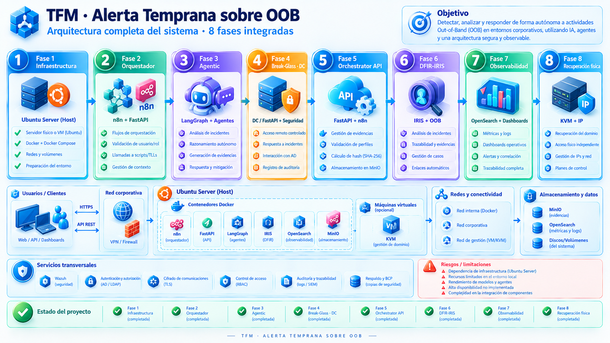
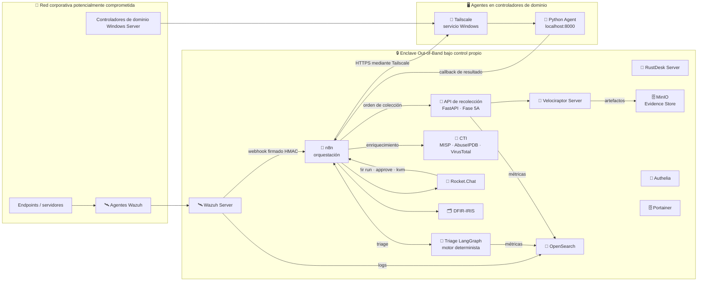
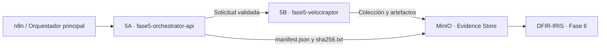

# 🚨 Sistema de Alerta Temprana Out-of-Band para Respuesta a Incidentes

## Respuesta a Incidentes con War Rooms, IA Agéntica y Trazabilidad Total

> **Objetivo:** Disponer de un entorno **completamente aislado** para coordinar incidentes cuando el entorno corporativo puede estar comprometido, automatizando **war rooms**, **aprobaciones**, **acceso remoto temporal**, **captura forense**, **gestión de casos** y **triage inteligente mediante IA agéntica**.
>
> **Principio fundamental:** Todo el proyecto se basa en una arquitectura **Out-of-Band**: el operador controla todos los servicios y dónde se ejecutan (VPS, cloud u on-premise), evitando dependencias de servicios externos críticos.

---

<b>🗺️ Índice interactivo</b> <i>(Haz clic para colapsar o expandir)</i>

- [🎯 Objetivos del proyecto](#-objetivos-del-proyecto)
- [🧱 Stack de componentes](#-stack-de-componentes)
- [🏗️ Arquitectura del enclave](#️-arquitectura-del-enclave)
- [🔁 Flujo principal](#-flujo-principal)
- [📈 Estado del proyecto](#-estado-del-proyecto)
- [🎯 Métricas objetivo](#-métricas-objetivo)
- [📦 Entregables del TFM](#-entregables-del-tfm)
- [⚠️ Nota técnica sobre la carpeta fase6-iris](#️-nota-técnica-sobre-la-carpeta-fase6-iris)

---

## 🎯 Objetivos del proyecto

- 🧩 Crear automáticamente War Rooms por incidente en Rocket.Chat.
- 📡 Recibir alertas desde Wazuh y clasificarlas.
- 🧠 Aplicar triage inteligente con apoyo de IA agéntica.
- 🔎 Enriquecer alertas con CTI y fuentes de inteligencia.
- ✅ Ejecutar acciones de respuesta con control y aprobación humana.
- 🧾 Mantener trazabilidad completa del caso y de las evidencias.

---

## 🧱 Stack de componentes

| Capa | Tecnología | Rol | Despliegue |
|:---:|:---|:---|:---:|
| 🛎️ **Detección** | Wazuh | Alertas, telemetría y respuesta inicial. | Docker |
| 💬 **Comunicación OOB** | Rocket.Chat | War Rooms, coordinación y bot de orquestación. | Docker |
| 🧭 **Orquestación** | n8n | Workflows de alerta, deduplicación, enriquecimiento CTI, War Rooms, aprobaciones e integración con IRIS. | Docker |
| 🧪 **API de recolección** | FastAPI (Fase 5A) | Validación de perfiles, orden de colección a Velociraptor y manifiestos de evidencia, con autenticación HMAC. | Docker |
| 🔎 **CTI** | MISP + AbuseIPDB + VirusTotal | Enriquecimiento de indicadores, consultado desde n8n. | Docker / servicios externos |
| 🧠 **Triage** | LangGraph | Clasificación de severidad; en producción, motor determinista. Un LLM local (Ollama) se evaluó en banco de pruebas y se descartó (ver Fase 3). | Docker |
| 🧪 **Forensics** | Velociraptor | Recolección remota y adquisición de evidencias. | Docker |
| 📦 **Evidence Store** | MinIO | Almacenamiento compatible con S3 para evidencias. | Docker |
| 📚 **Case Management** | DFIR-IRIS | Gestión de casos, timeline y evidencias. | Docker |
| 📊 **Observabilidad** | OpenSearch Dashboards | Métricas, búsquedas y análisis. | Docker |
| 🧰 **Acceso remoto** | RustDesk Server | Soporte remoto break-glass. | Docker |
| 🌐 **Conectividad DC** | Python + Tailscale | Ejecución controlada en hosts Windows y DCs. | Servicio Windows |
| 🖥️ **Gestión Docker** | Portainer | Administración visual de contenedores. | Docker |
| 🔐 **Autenticación** | Authelia | MFA e identidad independiente del AD. | Docker |
| 🧯 **Plan C** | GL.iNet KVM | Acceso físico on-premise de contingencia. | Hardware |

---

## 🏗️ Arquitectura del enclave

### Diagrama lógico de alto nivel

> **Nota:** La conectividad remota hacia los controladores de dominio se implementa mediante Tailscale con Headscale autoalojado, sustituyendo la propuesta inicial basada en Cloudflare Tunnels.

### Principios de diseño

- **Independencia total:** el enclave no depende del AD corporativo, del correo ni de la VPN de la empresa.
- **Autenticación propia:** Authelia proporciona MFA independiente del AD.
- **Control de servicios:** los servicios se ejecutan sobre infraestructura bajo control del operador.
- **Conectividad restringida:** los agentes de los controladores de dominio usan conexiones salientes mediante Tailscale; no se exponen puertos entrantes innecesarios.
- **Resolución alineada con la segmentación:** cada host resuelve solo los nombres que su rol necesita y que su política de red le permite alcanzar; una resolución global puentearía la microsegmentación. Estado declarado en [`docs/README-resolucion-nombres.md`](./docs/README-resolucion-nombres.md) y verificado por `scripts/verify-hosts.sh`.
- **Trazabilidad:** las decisiones de la IA, las aprobaciones humanas y las evidencias se registran en el caso del incidente.

---

## 🔁 Flujo principal

1. 🛰️ **Wazuh** detecta una alerta y su integrador `custom-n8n` la envía, firmada con HMAC, al webhook de **n8n**, que verifica la firma sobre los bytes recibidos.
2. 🧭 n8n deduplica las alertas (en memoria del proceso, con ventana fija) y las enriquece con CTI: MISP, AbuseIPDB y VirusTotal.
3. 🤖 El motor de **triage** de la Fase 3 (LangGraph, determinista en producción) clasifica la severidad.
4. 💬 Se crea una **War Room** en Rocket.Chat con una tarjeta de incidente enriquecida.
5. 🗂️ n8n crea el **caso DFIR-IRIS** y lo enlaza a la War Room (integración unidireccional, ver nota[^sync-iris]).
6. 🦖 n8n pide la colección a la **API de la Fase 5A**, que valida el perfil y la lanza en **Velociraptor** (colección forense no destructiva).
7. 📦 Los artefactos, el manifiesto y su SHA-256 se almacenan en MinIO, y la evidencia se registra en el caso de IRIS con el hash verificado.
8. ✅ Las acciones sensibles requieren aprobación humana desde la War Room, con comandos `!ir` que Rocket.Chat entrega a n8n por webhook saliente.
9. 🧯 El acceso break-glass mediante RustDesk se habilita temporalmente con TTL.
10. ⏱️ Si RustDesk no está disponible, el **Plan C** es el KVM GL.iNet, con autorización por dispositivo. La consola (`/cmd/`) y el proxy web (`/web/`) exigen la aprobación de un segundo IR Lead (`!ir kvm`, ventana de 15 minutos; construida, pendiente de acreditación por comportamiento). El reinicio de alimentación queda como vía de emergencia de nivel 2, auditada *a posteriori*. El paso de RustDesk al KVM no es automático.

---

## 📈 Estado del proyecto

Todas las fases principales están completadas. La Fase 5 se divide en **dos carpetas independientes** dentro del repositorio, por lo que se muestran como **Fase 5A** y **Fase 5B** para no confundir sus responsabilidades.

> **Importante sobre los enlaces:** cada enlace apunta **directamente a la carpeta de la fase**, no al fichero `README.md`. GitHub renderiza automáticamente el `README.md` de cualquier carpeta al abrirla, por lo que este formato es más robusto que enlazar al archivo explícito.

| Fase | Título | Estado | Responsabilidad | Enlace |
|:---:|:---|:---:|:---|:---:|
| **1** | **Infraestructura base** | ✅ Completada | Docker, Rocket.Chat, Wazuh, Authelia y red privada. | [Ver Fase 1](./fase1-infraestructura) |
| **2** | **Orquestador MVP** | ✅ Completada | n8n: ingesta firmada de Wazuh, deduplicación, enriquecimiento CTI, War Rooms y aprobaciones. | [Ver Fase 2](./fase2-orquestador) |
| **3** | **IA agéntica** | ✅ Completada | LangGraph: motor de triage determinista en producción; LLM local (Ollama) evaluado en banco de pruebas y descartado. | [Ver Fase 3](./fase3-agentic) |
| **4** | **Break-glass y scripts DC** | ✅ Completada | RustDesk, agentes Python y Tailscale en controladores de dominio. | [Ver Fase 4](./fase4-breakglass-dc) |
| **5A** | **Fase 5 · Orchestrator API** | ✅ Completada | API FastAPI, validación de perfiles, manifiestos y persistencia de metadatos en MinIO. | [Ver Fase 5A](./fase5-orchestrator-api) |
| **5B** | **Fase 5 · Velociraptor** | ✅ Completada | Servidor Velociraptor, perfiles de colección, agentes y pipeline de evidencias. | [Ver Fase 5B](./fase5-velociraptor) |
| **6** | **DFIR-IRIS Case Management** | ✅ Completada | Gestión de casos, evidencias y timeline (integración n8n → IRIS unidireccional; ver nota[^sync-iris]). Ver estado de seguridad y verificación en el README de la fase. | [Ver Fase 6](./fase6-iris) |
| **7** | **Observabilidad** | ✅ Completada | OpenSearch Dashboards y pipeline de métricas operativas. Dashboard exportado y versionado; datos de prueba no reproducibles desde el repositorio (ver README de la fase). | [Ver Fase 7](./fase7-observabilidad) |
| **8** | **Plan C y hardening** | ✅ Completada | KVM GL.iNet como Plan C (sin conmutación automática desde RustDesk), autorización por dispositivo y de segunda persona, validación TLS del canal y pruebas de resiliencia. | [Ver Fase 8](./fase8-kvm) |

[^sync-iris]: **Corrección (2026-09-21).** Esta fila describía la responsabilidad de la Fase 6 como "sincronización bidireccional". Verificado contra `fase2-orquestador/n8n/workflows/wazuh-alert-handler.json` y `fase4-breakglass-dc/workflows/fase4d-breakglass.json`: las únicas llamadas a la API de IRIS son de escritura (crear caso, añadir evidencia, añadir evento de timeline) o de lectura para verificar una escritura propia (`case/evidences/list`, tras un `case/evidences/add`, para comprobar el hash que el propio flujo acaba de subir); la resolución de `case_id` se hace parseando el nombre del canal de Rocket.Chat, no consultando el estado de IRIS. Ningún componente del proyecto consume webhooks salientes de IRIS ni sondea cambios hechos de forma independiente en su interfaz (por ejemplo, cerrar un caso o añadir una nota desde la propia UI de IRIS no se propaga a ningún otro sitio). La integración es **unidireccional** (n8n/orchestrator → IRIS), tal como ya lo documenta `fase6-iris/README.md` en su lista "No implementado" ("Sincronización bidireccional por webhooks"). El texto anterior de esta fila decía "sincronización bidireccional y timeline"; se mantiene esta nota para que quede constancia del cambio.

### Relación entre las dos partes de la Fase 5

| Componente | Hace | No hace |
|---|---|---|
| **5A - Orchestrator API** (`fase5-orchestrator-api/`) | Recibe la solicitud, valida el perfil, coordina el flujo y genera la trazabilidad. | No sustituye al servidor Velociraptor ni representa por sí solo la colección forense real. |
| **5B - Velociraptor** (`fase5-velociraptor/`) | Ejecuta o gestiona la colección forense y produce los artefactos. | No es la API principal de recepción y coordinación del incidente. |

---

## 🎯 Métricas objetivo

> [!NOTE]
> Esta tabla enuncia **objetivos de diseño**, no resultados medidos. Declarar
> un objetivo y no alcanzarlo todavía es legítimo en un TFM; lo que no lo es
> es no poder distinguir el objetivo del resultado. La columna "Estado de
> medición" (añadida el 2026-09-21) remite al detalle y al cálculo completo
> en [`docs/tfm/metricas-calculadas.md`](./docs/tfm/metricas-calculadas.md).

| Métrica | Descripción | Objetivo | Estado de medición (2026-09-21) |
|:---|:---|:---:|:---|
| ⏱️ **MTTA** | Alerta → War Room creada | < 60 segundos | No calculable — no hay instrumentación del evento de creación del War Room |
| ✅ **MTTApprove** | Solicitud de aprobación → decisión | < 5 minutos | No calculable — solo consta el límite de política (15 min de caducidad de la solicitud), no una latencia medida |
| 🚀 **MTTAccess** | Aprobación → acceso activo | < 3 minutos | No calculable — mismo motivo que MTTApprove |
| 📦 **MTTCollection** | Disparo → artefactos en MinIO | < 10 minutos | Calculable parcialmente: 2 mediciones reales (9 s y 12,0 s); consulta a OpenSearch propuesta para ampliar la muestra |
| 🔁 **Dedup rate** | Alertas correctamente deduplicadas | > 95 % | No calculable — el mecanismo de deduplicación vive en memoria del proceso de n8n y no deja registro |
| 🧠 **Agent precision** | Triage del agente frente a experto humano | > 80 % | No calculable tal como está definida (el propio proyecto la declara fuera de alcance del TFM); existe un proxy no equivalente: concordancia con el motor determinista, 100 % en modo `hybrid` (n=30) y 23,3 % en modo `llm` (n=30) |
| 🚫 **False positive rate** | Alertas que no llegan a aprobación | < 15 % | No calculable — la definición operativa de "falso positivo" no está resuelta en el repositorio y no hay instrumentación del resultado de cada alerta |
| ⚙️ **Script success rate** | Ejecuciones en DC con resultado correcto | > 98 % | Calculable como tasa de superación de la batería de pruebas de Fase 4 (no como tasa operativa en producción): 25/25 = 100 % (n=25) |

---

## 🔬 Resultados transversales

Tres resultados que no pertenecen a ninguna fase y son reproducibles fuera de
este enclave. Los tres están medidos, no argumentados.

**Credenciales y superficie de arranque.** Lo que se crea para poner un proyecto
en marcha sobrevive a todas las revisiones posteriores, porque precede a la
arquitectura que acaba contradiciendo y porque funciona. Cuatro instancias
verificadas, de mayo a agosto, ninguna encontrada por una revisión deliberada.
Regla derivada: un inventario de credenciales necesita dos ejes, qué existe **y
cuándo se creó**. → [`docs/credenciales-de-arranque.md`](./docs/credenciales-de-arranque.md),
[`docs/revision-credenciales-fases1-8.md`](./docs/revision-credenciales-fases1-8.md)

**Delegar autorización en un orquestador de flujos tiene un modo de fallo
abierto.** Un error no capturado dentro de n8n hace que responda `200` por
defecto, que el consumidor lee como aprobación. El control falla cerrado ante
caída del servicio y **abierto** ante error propio, que es el caso más probable.
→ [`docs/cierre-mejora1-hook.md`](./docs/cierre-mejora1-hook.md) §3

**Los instrumentos de diagnóstico fallan en silencio.** Ocho casos registrados en
el proyecto, todos con la misma forma: el instrumento no protesta y devuelve algo
plausible en lugar de un error. La única defensa es contrastar con un segundo
instrumento que mida lo mismo por otra vía.
→ [`docs/api-reconocimiento-fase8.md`](./docs/api-reconocimiento-fase8.md) §1

---

## 📦 Entregables del TFM

- 📁 Repositorio GitHub con despliegue reproducible.
- 📄 README principal y README específico de cada fase (dentro de su propia carpeta).
- 🧾 Documentación técnica de las dos partes de la Fase 5.
- ⚙️ Scripts, archivos `docker-compose.yml` y configuraciones del enclave.
- 🧪 Evidencias de pruebas y validación por fase.
- 🗺️ Diagramas de arquitectura, estados y flujos.
- 📊 Métricas de evaluación del sistema y del triage agéntico.

---

## 📝 Registro de correcciones

- **2026-09-24.** Corregida la descripción de la arquitectura, que presentaba
  una Fase 2 basada en FastAPI, PostgreSQL y Redis que nunca llegó a
  implementarse (la orquestación es n8n; FastAPI es la API de recolección de
  la Fase 5A), webhooks salientes de IRIS que ningún componente consume, un
  triage con CTI en la Fase 3 (el CTI se consulta desde n8n, y en producción
  el triage es determinista) y un Plan C con doble aprobación para acciones
  disruptivas y conmutación automática desde RustDesk, que no existen tal como
  se enunciaban. Hallazgos A-3, A-4 y A-5 de
  [`docs/AUDITORIA-CIERRE-2026-09-23.md`](./docs/AUDITORIA-CIERRE-2026-09-23.md).
  El texto anterior se conserva en el historial de git.

- **2026-09-24.** Fase 7: dashboard exportado y versionado en
  `fase7-observabilidad/dashboards/`; la fase deja constancia de que los datos
  de prueba no son reproducibles desde el repositorio. Hallazgo B-8 de la
  auditoría de cierre.
