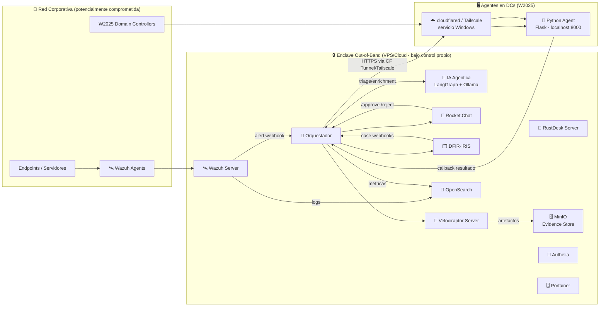

# 🚨 Sistema de Alerta Temprana Out-of-Band para Respuesta a Incidentes (v3)

## Respuesta a Incidentes con War Rooms, IA Agéntica y Trazabilidad Total

> **Objetivo:** Disponer de un entorno **completamente aislado** para coordinar incidentes cuando el entorno corporativo puede estar comprometido, automatizando **war rooms**, **aprobaciones**, **acceso remoto temporal**, **captura forense**, **gestión de caso** y **triage inteligente mediante IA agéntica**.
>
> **Principio fundamental:** Todo el proyecto se basa en arquitectura **Out-of-Band** — el operador controla todos los servicios y dónde se ejecutan (VPS, Cloud, on-prem). Cero dependencias de servicios externos críticos.

---

<b>🗺️ Índice Interactivo</b> <i>(Haz clic para colapsar/expandir)</i>

- [🎯 Objetivos del proyecto](#-objetivos-del-proyecto)
- [🧱 Stack de Componentes](#-stack-de-componentes)
- [🏗️ Arquitectura del Enclave (Out-of-Band)](#️-arquitectura-del-enclave-out-of-band)
- [🔁 Flujo Principal](#-flujo-principal)
- [📈 Estado del Proyecto (Fases)](#-estado-del-proyecto-fases)
- [🎯 Métricas Objetivo](#-métricas-objetivo)
- [📦 Entregables del TFM](#-entregables-del-tfm)

---

## 🎯 Objetivos del proyecto

- 🧩 Crear automáticamente War Rooms por incidente en Rocket.Chat.
- 📡 Recibir alertas desde Wazuh y clasificarlas.
- 🧠 Aplicar triage inteligente con apoyo de IA agéntica.
- 🔎 Enriquecer alertas con CTI y fuentes externas.
- ✅ Ejecutar acciones de respuesta con control y aprobación humana.
- 🧾 Mantener trazabilidad completa del caso y de las evidencias.

---

## 🧱 Stack de Componentes

| Capa | Tecnología | Rol | Deploy |
|:---:|:---|:---|:---:|
| 🛎️ **Detección** | Wazuh | Alertas, telemetría y respuesta inicial. | Docker |
| 💬 **Comunicación OOB** | Rocket.Chat | War Rooms, coordinación y bot de orquestación. | Docker |
| 🧭 **Orquestación** | FastAPI + PostgreSQL + Redis | Motor de decisión y workflows. | Docker |
| 🧠 **IA Agéntica** | LangGraph + Ollama | Triage inteligente y apoyo a decisiones. | Docker |
| 🧪 **Forensics** | Velociraptor | Recolección remota y adquisición de evidencias. | Docker |
| 📦 **Evidence Store** | MinIO | Almacenamiento S3-compatible de evidencias. | Docker |
| 📚 **Case Management**| DFIR-IRIS | Gestión de casos, timeline y evidencias. | Docker |
| 📊 **Observabilidad** | OpenSearch Dashboards | Métricas, búsqueda y análisis. | Docker |
| 🧰 **Acceso remoto** | RustDesk Server | Soporte remoto break-glass. | Docker |
| 🌐 **Conectividad DC** | Python + Tailscale | Ejecución controlada en hosts Windows y DCs. | Servicio Win |
| 🖥️ **Gestión Docker** | Portainer | Administración visual de contenedores. | Docker |
| 🔐 **Autenticación** | Authelia | MFA e identidad independiente del AD. | Docker |
| 🧯 **Plan C** | GL.iNet KVM | Acceso físico on-prem de contingencia. | Hardware |

---

## 🏗️ Arquitectura del Enclave (Out-of-Band)

### Diagrama lógico de alto nivel

*Nota: La conectividad remota en DCs se actualizó para usar Tailscale (ver Fase 4).*

### Principios de diseño del Enclave

- **Independencia total**: El enclave no depende del AD corporativo, correo, ni VPN de la empresa.
- **Autenticación propia**: Authelia provee MFA independiente del AD; los analistas se autentican incluso si el AD está comprometido.
- **Control total de servicios**: Todos los servicios corren en infraestructura bajo control del operador (VPS, Cloud propio, on-prem dedicado).
- **Túneles salientes**: Los agentes en endpoints/DCs usan Cloudflare Tunnels/Tailscale (conexión *outbound*) — no hay puertos abiertos hacia internet en los endpoints.

---

## 🔁 Flujo Principal

1. 🛰️ **Wazuh** detecta alerta HIGH/CRITICAL → envía JSON al Orquestador (`POST /wazuh/alert`).
2. 🧠 Orquestador correlaciona/deduplica (Redis TTL) y crea el incidente.
3. 🤖 **Triage Agent** (LangGraph) recibe el evento y realiza triage autónomo consultando CTI y buscando históricos en IRIS.
4. 💬 Se crea **War Room** (Rocket.Chat) con *Incident Card* enriquecida.
5. 🗂️ Se crea **Caso DFIR-IRIS** enlazado al canal; el agente añade su nota.
6. 🦖 **Velociraptor** lanza colección en paralelo sin esperar aprobación (acción no destructiva).
7. 💬 Si se requiere acción en el DC, el Orquestador solicita aprobación en Rocket.Chat. Si se aprueba, se ejecuta el script vía el agente Python en el DC autenticado.
8. 💬 Se puede solicitar acceso remoto temporal Break-Glass habilitando RustDesk por 30 minutos, previa aprobación.
9. ⏱️ Si RustDesk falla (Timeout), se ofrece el **Plan C (KVM)**, requiriendo aprobaciones adicionales para ejecutar un power reset.

---

## 📈 Estado del Proyecto (Fases)

A continuación, se resume el progreso del proyecto. Todas las fases han sido completadas con éxito, estableciendo un sistema integral y funcional.

| Fase | Título | Estado | Descripción Breve | Enlace |
|:---:|:---|:---:|:---|:---:|
| **1** | **Infraestructura Base** | ✅ `Completada` | Despliegue de Docker, Rocket.Chat, Wazuh, Authelia y red privada. | [Ver Fase 1](./README_fase1_CORREGIDO.md) |
| **2** | **Orquestador MVP** | ✅ `Completada` | FastAPI, PostgreSQL, Redis. Ingesta, War Rooms y aprobaciones. | [Ver Fase 2](./README_fase2_CORREGIDO.md) |
| **3** | **IA Agéntica** | ✅ `Completada` | LangGraph, Ollama. Triage inteligente, CTI y `agentreasoning`. | [Ver Fase 3](./README_fase3_CORREGIDO.md) |
| **4** | **Break-Glass & Scripts DC** | ✅ `Completada` | Acceso remoto con RustDesk, Python Agents y Tailscale en DCs. | [Ver Fase 4](./README_fase4_CORREGIDO.md) |
| **5** | **Forensics Automático** | ✅ `Completada` | Velociraptor, MinIO (Evidence Store) y pipeline hacia IRIS. | [Ver Fase 5](./README_fase5_CORREGIDO.md) |
| **6** | **DFIR-IRIS Case Mgmt** | ✅ `Completada` | Gestión de casos, sincronización bidireccional y timeline automático. | [Ver Fase 6](./README_fase6_CORREGIDO.md) |
| **7** | **Observabilidad** | ✅ `Completada` | OpenSearch Dashboards, pipeline de métricas operativas. | [Ver Fase 7](./README_fase7_CORREGIDO.md) |
| **8** | **Plan C (KVM) & Hardening** | ✅ `Completada` | Fallback a GL.iNet KVM, mTLS, y pruebas de resiliencia finales. | [Ver Fase 8](./README_fase8_CORREGIDO.md) |

---

## 🎯 Métricas Objetivo

| Métrica | Descripción | Objetivo |
|:---|:---|:---:|
| ⏱️ **MTTA** | Alerta → War Room creado | < 60 segundos |
| ✅ **MTTApprove** | Solicitud aprobación → decisión | < 5 minutos |
| 🚀 **MTTAccess** | Aprobación → acceso activo | < 3 minutos |
| 📦 **MTTCollection** | Trigger → artefactos en MinIO | < 10 minutos |
| 🔁 **Dedup rate** | % alertas correctamente deduplicadas | > 95% |
| 🧠 **Agent precision** | Triage agente vs. experto humano | > 80% |
| 🚫 **False positive rate**| Alertas que no llegan a aprobación | < 15% |
| ⚙️ **Script success rate**| Ejecuciones DC con resultado OK | > 98% |

---

## 📦 Entregables del TFM

- 📁 Repositorio GitHub con despliegue reproducible.
- 📄 README principal y README de cada fase.
- 🧾 Documentación técnica por fases y subfases.
- ⚙️ Scripts, `docker-compose.yml` y configuraciones del enclave.
- 🧪 Evidencia de pruebas y validación por fase.
- 🗺️ Diagramas de arquitectura, estados y flujos.
- 📊 Métricas de evaluación del sistema y del triage agéntico.
