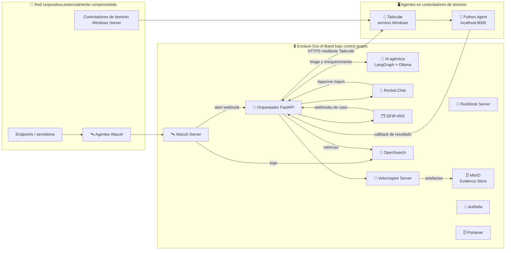
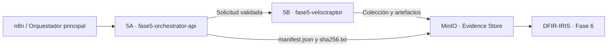

# 🚨 Sistema de Alerta Temprana Out-of-Band para Respuesta a Incidentes

## Respuesta a Incidentes con War Rooms, IA Agéntica y Trazabilidad Total

> **Objetivo:** Disponer de un entorno **completamente aislado** para coordinar incidentes cuando el entorno corporativo puede estar comprometido, automatizando **war rooms**, **aprobaciones**, **acceso remoto temporal**, **captura forense**, **gestión de casos** y **triage inteligente mediante IA agéntica**.
>
> **Principio fundamental:** Todo el proyecto se basa en una arquitectura **Out-of-Band**: el operador controla todos los servicios y dónde se ejecutan (VPS, cloud u on-premise), evitando dependencias de servicios externos críticos.

---

<b>🗺️ Índice interactivo</b> <i>(Haz clic para colapsar o expandir)</i>

- [🎯 Objetivos del proyecto](#-objetivos-del-proyecto)
- [🧱 Stack de componentes](#-stack-de-componentes)
- [🏗️ Arquitectura del enclave](#️-arquitectura-del-enclave)
- [🔁 Flujo principal](#-flujo-principal)
- [📈 Estado del proyecto](#-estado-del-proyecto)
- [🎯 Métricas objetivo](#-métricas-objetivo)
- [📦 Entregables del TFM](#-entregables-del-tfm)
- [⚠️ Nota técnica sobre la carpeta fase6-iris](#️-nota-técnica-sobre-la-carpeta-fase6-iris)

---

## 🎯 Objetivos del proyecto

- 🧩 Crear automáticamente War Rooms por incidente en Rocket.Chat.
- 📡 Recibir alertas desde Wazuh y clasificarlas.
- 🧠 Aplicar triage inteligente con apoyo de IA agéntica.
- 🔎 Enriquecer alertas con CTI y fuentes de inteligencia.
- ✅ Ejecutar acciones de respuesta con control y aprobación humana.
- 🧾 Mantener trazabilidad completa del caso y de las evidencias.

---

## 🧱 Stack de componentes

| Capa | Tecnología | Rol | Despliegue |
|:---:|:---|:---|:---:|
| 🛎️ **Detección** | Wazuh | Alertas, telemetría y respuesta inicial. | Docker |
| 💬 **Comunicación OOB** | Rocket.Chat | War Rooms, coordinación y bot de orquestación. | Docker |
| 🧭 **Orquestación** | FastAPI + PostgreSQL + Redis | Motor de decisión y workflows. | Docker |
| 🧠 **IA agéntica** | LangGraph + Ollama | Triage inteligente y apoyo a decisiones. | Docker |
| 🧪 **Forensics** | Velociraptor | Recolección remota y adquisición de evidencias. | Docker |
| 📦 **Evidence Store** | MinIO | Almacenamiento compatible con S3 para evidencias. | Docker |
| 📚 **Case Management** | DFIR-IRIS | Gestión de casos, timeline y evidencias. | Docker |
| 📊 **Observabilidad** | OpenSearch Dashboards | Métricas, búsquedas y análisis. | Docker |
| 🧰 **Acceso remoto** | RustDesk Server | Soporte remoto break-glass. | Docker |
| 🌐 **Conectividad DC** | Python + Tailscale | Ejecución controlada en hosts Windows y DCs. | Servicio Windows |
| 🖥️ **Gestión Docker** | Portainer | Administración visual de contenedores. | Docker |
| 🔐 **Autenticación** | Authelia | MFA e identidad independiente del AD. | Docker |
| 🧯 **Plan C** | GL.iNet KVM | Acceso físico on-premise de contingencia. | Hardware |

---

## 🏗️ Arquitectura del enclave

### Diagrama lógico de alto nivel

> **Nota:** La conectividad remota hacia los controladores de dominio se implementa mediante Tailscale con Headscale autoalojado, sustituyendo la propuesta inicial basada en Cloudflare Tunnels.

### Principios de diseño

- **Independencia total:** el enclave no depende del AD corporativo, del correo ni de la VPN de la empresa.
- **Autenticación propia:** Authelia proporciona MFA independiente del AD.
- **Control de servicios:** los servicios se ejecutan sobre infraestructura bajo control del operador.
- **Conectividad restringida:** los agentes de los controladores de dominio usan conexiones salientes mediante Tailscale; no se exponen puertos entrantes innecesarios.
- **Trazabilidad:** las decisiones de la IA, las aprobaciones humanas y las evidencias se registran en el caso del incidente.

---

## 🔁 Flujo principal

1. 🛰️ **Wazuh** detecta una alerta y envía el JSON al Orquestador mediante `POST /wazuh/alert`.
2. 🧭 El Orquestador correlaciona y deduplica las alertas mediante Redis TTL.
3. 🤖 El **Triage Agent** realiza el análisis y el enriquecimiento con CTI.
4. 💬 Se crea una **War Room** en Rocket.Chat con una tarjeta de incidente enriquecida.
5. 🗂️ Se crea o actualiza el **caso DFIR-IRIS** asociado.
6. 🦖 Velociraptor lanza la colección forense no destructiva según el perfil seleccionado.
7. 📦 Los artefactos y metadatos se almacenan en MinIO.
8. ✅ Las acciones sensibles requieren aprobación humana desde la War Room.
9. 🧯 El acceso break-glass mediante RustDesk se habilita temporalmente con TTL.
10. ⏱️ Si RustDesk falla, se ofrece el **Plan C mediante KVM**, con doble aprobación para acciones disruptivas.

---

## 📈 Estado del proyecto

Todas las fases principales están completadas. La Fase 5 se divide en **dos carpetas independientes** dentro del repositorio, por lo que se muestran como **Fase 5A** y **Fase 5B** para no confundir sus responsabilidades.

> **Importante sobre los enlaces:** cada enlace apunta **directamente a la carpeta de la fase**, no al fichero `README.md`. GitHub renderiza automáticamente el `README.md` de cualquier carpeta al abrirla, por lo que este formato es más robusto que enlazar al archivo explícito.

| Fase | Título | Estado | Responsabilidad | Enlace |
|:---:|:---|:---:|:---|:---:|
| **1** | **Infraestructura base** | ✅ Completada | Docker, Rocket.Chat, Wazuh, Authelia y red privada. | [Ver Fase 1](./fase1-infraestructura) |
| **2** | **Orquestador MVP** | ✅ Completada | FastAPI, PostgreSQL, Redis, ingesta, War Rooms y aprobaciones. | [Ver Fase 2](./fase2-orquestador) |
| **3** | **IA agéntica** | ✅ Completada | LangGraph, Ollama, triage inteligente y CTI. | [Ver Fase 3](./fase3-agentic) |
| **4** | **Break-glass y scripts DC** | ✅ Completada | RustDesk, agentes Python y Tailscale en controladores de dominio. | [Ver Fase 4](./fase4-breakglass-dc) |
| **5A** | **Fase 5 · Orchestrator API** | ✅ Completada | API FastAPI, validación de perfiles, manifiestos y persistencia de metadatos en MinIO. | [Ver Fase 5A](./fase5-orchestrator-api) |
| **5B** | **Fase 5 · Velociraptor** | ✅ Completada | Servidor Velociraptor, perfiles de colección, agentes y pipeline de evidencias. | [Ver Fase 5B](./fase5-velociraptor) |
| **6** | **DFIR-IRIS Case Management** | ✅ Completada | Gestión de casos, sincronización bidireccional y timeline. | [Ver Fase 6](./fase6-iris) — ⚠️ ver nota abajo, el README propio es `README-Iris.md` |
| **7** | **Observabilidad** | ✅ Completada | OpenSearch Dashboards y pipeline de métricas operativas. | [Ver Fase 7](./fase7-observabilidad) |
| **8** | **Plan C y hardening** | ✅ Completada | Fallback a GL.iNet KVM, mTLS y pruebas de resiliencia. | [Ver Fase 8](./fase8-kvm) |

### Relación entre las dos partes de la Fase 5

| Componente | Hace | No hace |
|---|---|---|
| **5A - Orchestrator API** (`fase5-orchestrator-api/`) | Recibe la solicitud, valida el perfil, coordina el flujo y genera la trazabilidad. | No sustituye al servidor Velociraptor ni representa por sí solo la colección forense real. |
| **5B - Velociraptor** (`fase5-velociraptor/`) | Ejecuta o gestiona la colección forense y produce los artefactos. | No es la API principal de recepción y coordinación del incidente. |

---

## 🎯 Métricas objetivo

| Métrica | Descripción | Objetivo |
|:---|:---|:---:|
| ⏱️ **MTTA** | Alerta → War Room creada | < 60 segundos |
| ✅ **MTTApprove** | Solicitud de aprobación → decisión | < 5 minutos |
| 🚀 **MTTAccess** | Aprobación → acceso activo | < 3 minutos |
| 📦 **MTTCollection** | Disparo → artefactos en MinIO | < 10 minutos |
| 🔁 **Dedup rate** | Alertas correctamente deduplicadas | > 95 % |
| 🧠 **Agent precision** | Triage del agente frente a experto humano | > 80 % |
| 🚫 **False positive rate** | Alertas que no llegan a aprobación | < 15 % |
| ⚙️ **Script success rate** | Ejecuciones en DC con resultado correcto | > 98 % |

---

## 📦 Entregables del TFM

- 📁 Repositorio GitHub con despliegue reproducible.
- 📄 README principal y README específico de cada fase (dentro de su propia carpeta).
- 🧾 Documentación técnica de las dos partes de la Fase 5.
- ⚙️ Scripts, archivos `docker-compose.yml` y configuraciones del enclave.
- 🧪 Evidencias de pruebas y validación por fase.
- 🗺️ Diagramas de arquitectura, estados y flujos.
- 📊 Métricas de evaluación del sistema y del triage agéntico.

---

## ⚠️ Nota técnica sobre la carpeta fase6-iris

La carpeta [`fase6-iris`](./fase6-iris) contiene una copia completa del código fuente de **DFIR-IRIS** (proyecto upstream), incluyendo sus propios ficheros de metadatos (`LICENSE.txt`, `CODESTYLE.md`, `.deepsource.toml`, `.bumpversion.cfg`, `.github/`) y su propio `README.md` original del proyecto IRIS. Por eso esta carpeta contiene **dos README distintos**:

- `fase6-iris/README.md` → README original de DFIR-IRIS (upstream, no editar).
- `fase6-iris/README-Iris.md` → README específico de la Fase 6 de este TFM (documentación propia).

> **Importante:** como esta carpeta tiene por defecto el `README.md` de IRIS (no el tuyo), al hacer clic en [Ver Fase 6](./fase6-iris) GitHub mostrará primero el README de IRIS. Para llegar a la documentación propia de la Fase 6, hay que abrir explícitamente [`fase6-iris/README-Iris.md`](./fase6-iris/README-Iris.md) desde dentro de la carpeta.
>
> **Recomendación para resolver el aviso *"Cannot retrieve latest commit at this time"*:** es probable que se deba al volumen y a los metadatos de CI/CD (`.github/workflows`, `.deepsource.toml`) heredados del repositorio de IRIS. Para resolverlo de forma definitiva:
> 1. Añadir `fase6-iris` como **submódulo git** apuntando al repositorio oficial de DFIR-IRIS, en lugar de copiar sus archivos directamente.
> 2. Eliminar del código copiado los metadatos específicos de CI/CD que no aplican a este repositorio (`.github/workflows`, `.deepsource.toml`, `.bumpversion.cfg`).
> 3. Renombrar `README-Iris.md` a `README.md` únicamente si se elimina o mueve el README original de IRIS a otro nombre (por ejemplo `README-UPSTREAM.md`), para que el enlace directo a la carpeta muestre tu documentación por defecto.

---

**Proyecto:** `tfm-alerta-temprana-oob`  
**Fase actual:** Fase 8 · Plan C y hardening  
**Autor:** Jose Luis Rey Vargas