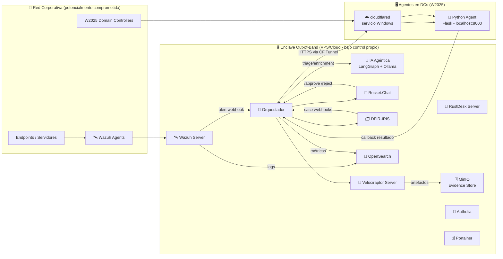

# 🛡️ Sistema de Alerta Temprana "Out-of-Band" para Respuesta a Incidentes (v3)
### Wazuh ➜ Rocket.Chat ➜ (Break-Glass SW) RustDesk ➜ (Forensics) Velociraptor ➜ (Case Mgmt) DFIR-IRIS
### + (IA Agéntica) LangGraph + Ollama ➜ (Plan C en servidores) GL.iNet KVM ➜ (Observabilidad) OpenSearch
### + (Agentes DC) Cloudflare Tunnels + Python Agents (W2025 Server)

> **Objetivo:** disponer de un entorno **completamente aislado** para coordinar incidentes cuando el entorno corporativo
> puede estar comprometido, automatizando **war rooms**, **aprobaciones**, **acceso remoto temporal**,
> **captura forense**, **gestión de caso** y **triage inteligente mediante IA agéntica**.
>
> **Principio fundamental:** todo el proyecto se basa en arquitectura **Out-of-Band** — el operador controla
> todos los servicios y dónde se ejecutan (VPS, Cloud, on-prem). Cero dependencias de servicios externos críticos.

---

## ✅ 1) Stack de Componentes — Vista Completa (v3)

| Componente | Rol | Cuándo se usa | Deploy |
|---|---|---|---|
| 🛰️ **Wazuh** | Detección (SIEM/EDR) + disparo de automatizaciones | Siempre | Docker |
| 💬 **Rocket.Chat** | Coordinación out-of-band + aprobaciones + bots | Siempre | Docker |
| 🧠 **Orquestador** | Correlación, estado, automatización, auditoría | Siempre | Docker (FastAPI) |
| 🤖 **IA Agéntica** | Triage automático, enrichment CTI, playbooks dinámicos | HIGH/CRITICAL | Docker (LangGraph + Ollama) |
| 🧯 **RustDesk (SW)** | Acceso remoto temporal "break-glass" | Endpoints/servidores | Docker (server) |
| 🦖 **Velociraptor** | Colección forense automática (agente pre-instalado) | HIGH/CRITICAL | Docker (server) |
| 🗂️ **DFIR-IRIS** | Gestión de caso DFIR (evidencias, timeline, tareas, IOC) | Recomendado | Docker |
| 🧲 **OpenSearch** | Observabilidad: logs/métricas del flujo end-to-end | Recomendado | Docker |
| 🌩️ **Cloudflare Tunnels** | Túnel TLS seguro hacia agentes locales en DCs/endpoints | Agentes en DC/W2025 | cloudflared (servicio Windows) |
| 🐍 **Python Agents (DC)** | Scripts ejecutados en DCs W2025 via webhook autenticado | Acciones en AD/DC | Servicio Windows (Flask/FastAPI) |
| 🧩 **GL.iNet KVM** | Plan C (solo servidores on-prem): acceso físico OOB + power/reset | Cuando RustDesk/OS no es confiable | Hardware |
| 🗄️ **Portainer** | Gestión visual de contenedores Docker | Administración | Docker |
| 🔐 **MinIO** | Evidence Store S3-compatible para artefactos forenses | Velociraptor + evidencias | Docker |
| 🔑 **Authelia** | IdP MFA out-of-band independiente del AD corporativo | Autenticación enclave | Docker |

---

## 🏗️ 2) Arquitectura del Enclave (Out-of-Band)

### 2.1 Diagrama lógico de alto nivel



### 2.2 Principios de diseño del Enclave

- **Independencia total**: el enclave no depende del AD corporativo, correo, ni VPN de la empresa.
- **Autenticación propia**: Authelia provee MFA independiente del AD; los analistas se autentican incluso si el AD está comprometido.
- **Control total de servicios**: todos los servicios corren en infraestructura bajo control del operador (VPS, Cloud propio, on-prem dedicado).
- **Túneles salientes**: los agentes en endpoints/DCs usan Cloudflare Tunnels (conexión *outbound*) — no hay puertos abiertos hacia internet en los endpoints.

---

## 🔁 3) Flujo Principal Actualizado (v3)

### 3.1 Trigger y Triage Agéntico

1. 🛰️ **Wazuh** detecta alerta HIGH/CRITICAL → envía JSON al Orquestador (`POST /wazuh/alert`).
2. 🧠 Orquestador correlaciona/deduplica (Redis TTL) y crea el incidente.
3. 🤖 **Triage Agent** (LangGraph) recibe el evento y, de forma autónoma:
   - Consulta CTI: MISP (self-hosted), AbuseIPDB, VirusTotal API sobre IPs/hashes/dominios del evento.
   - Busca incidentes históricos similares en DFIR-IRIS.
   - Genera resumen enriquecido con contexto + IOCs + severidad revisada.
   - Decide qué perfil de colección Velociraptor lanzar.
   - Documenta su razonamiento en el campo `agent_reasoning` del caso IRIS (auditoría).

### 3.2 Coordinación y Caso

4. 💬 Se crea **War Room** (Rocket.Chat) con *Incident Card* enriquecida por el agente.
5. 🗂️ Se crea **Caso DFIR-IRIS** enlazado al canal; el Triage Agent añade nota con su análisis.

### 3.3 Forensics en Paralelo (Velociraptor)

6. 🦖 Sin esperar aprobación (acción no destructiva), se lanza colección Velociraptor:
   - Perfil elegido por el Triage Agent según tipo de incidente.
   - ZIP almacenado en MinIO: `/evidence/{incident_id}/{host}/{timestamp}/`.
   - Hash SHA-256 + manifest registrado en IRIS.

### 3.4 Ejecución de Scripts en DC (Cloudflare Tunnels)

7. 💬 Si el incidente requiere acción en el DC (ej. bloquear cuenta, deshabilitar objeto AD):
   - Orquestador solicita aprobación en War Room.
   - Si aprobado → `POST https://agent-dc01.tudominio.com/run` (autenticado con Bearer Token).
   - `cloudflared` en el DC redirige hacia `localhost:8000` (Python Agent).
   - El agente ejecuta el script PowerShell/Python con privilegios configurados.
   - Callback con resultado → Orquestador → publica en War Room + registra en IRIS.

### 3.5 Break-Glass RustDesk

8. 💬 Orquestador solicita aprobación: *"Habilitar RustDesk en HOST-X durante 30 min"*.
9. ✅ Aprobado → Active Response en Wazuh → habilitar RustDesk + credencial efímera → callback.
10. 💬 Se publica *Remote Access Card* (ID + TTL + operador) y se registra en IRIS.

### 3.6 Fallback Plan C — KVM (solo servidores on-prem)

11. ⏱️ Timeout RustDesk (120 s, 2 intentos) + activo `server_onprem` con KVM:
    - Se ofrece *Plan C: KVM*.
    - 1 aprobación para sesión KVM; **2 aprobaciones (IR Lead + IT Ops)** para power/reset.
    - Se publica enlace KVM + se registra en IRIS.

---

## 🤖 4) IA Agéntica — Diseño Detallado

### 4.1 Stack tecnológico (self-hosted)

| Componente | Tecnología | Deploy |
|---|---|---|
| Orquestación de agentes | **LangGraph** (Python) | Docker |
| LLM local | **Ollama** + Mistral-7B o Qwen2.5-7B | Docker (GPU/CPU) |
| CTI Integration | MISP (self-hosted) + AbuseIPDB API + VirusTotal API | Docker / API keys |
| Vector DB (memoria agente) | **ChromaDB** o **Qdrant** | Docker |

> **Por qué LLM local (Ollama):** Mantiene el principio out-of-band puro. El cerebro analítico del sistema
> no envía datos de incidentes a servicios externos (OpenAI, Anthropic, etc.).
> Mistral-7B o Qwen2.5-7B ofrecen capacidad suficiente para triage en CPU/GPU moderada.

### 4.2 Agentes Especializados (LangGraph)

```
┌─────────────────────────────────────────────────────────────┐
│                    TRIAGE AGENT                             │
│  ┌──────────────┐  ┌──────────────┐  ┌──────────────────┐  │
│  │ CTI Lookup   │  │ History      │  │ Severity         │  │
│  │ MISP/VT/AIPD │  │ Search IRIS  │  │ Reassessment     │  │
│  └──────────────┘  └──────────────┘  └──────────────────┘  │
└─────────────────────────────────────────────────────────────┘
         │
         ▼
┌─────────────────────────────────────────────────────────────┐
│                 FORENSICS AGENT                             │
│  Selecciona perfil Velociraptor según tipo de incidente     │
│  Genera recomendaciones de artefactos a recolectar          │
└─────────────────────────────────────────────────────────────┘
         │
         ▼
┌─────────────────────────────────────────────────────────────┐
│               COMMUNICATION AGENT                           │
│  Redacta Incident Card enriquecida para War Room            │
│  Genera resumen ejecutivo para IRIS                         │
│  Propone acciones de contención con justificación           │
└─────────────────────────────────────────────────────────────┘
```

### 4.3 Campo `agent_reasoning` en IRIS (auditoría)

Cada decisión del agente queda documentada en el caso IRIS:

```json
{
  "agent": "triage_agent_v1",
  "timestamp": "2026-05-02T20:30:00Z",
  "input_event": "wazuh_rule_87102",
  "cti_results": {
    "ip_192.168.1.50": "clean",
    "hash_abc123": "malicious (VirusTotal 45/70)"
  },
  "severity_assessment": "CRITICAL",
  "recommended_velociraptor_profile": "credential_dump_collection",
  "reasoning": "Hash detected as known credential dumper. Similar incident INC-2025-003 resolved with memory dump. Recommend immediate collection."
}
```

### 4.4 Playbooks Dinámicos

En lugar de playbooks estáticos, el agente genera el playbook **adaptado al contexto**:

- **Entrada**: alerta Wazuh + resultados CTI + historial IRIS.
- **Salida**: secuencia de pasos recomendados con justificación por cada paso.
- **Evaluación (TFM)**: comparación playbook agente vs. playbook manual por experto → métricas de precisión.

### 4.5 Endpoint del Orquestador para IA

```
POST /agent/triage     → disparar triage agéntico sobre incidente
POST /agent/playbook   → generar playbook dinámico
GET  /agent/reasoning/{incident_id} → consultar razonamientos del agente
```

---

## 🌩️ 5) Cloudflare Tunnels + Python Agents en W2025

### 5.1 Arquitectura del agente en DC

```
[Orquestador] --HTTPS--> [CF Tunnel URL] --[cloudflared]--> [localhost:8000] --[Python Agent Flask/FastAPI]
                                                              (W2025 Server DC)
```

### 5.2 Configuración cloudflared (servicio Windows en W2025)

```yaml
# config.yml (C:\Users\svc_agent\.cloudflared\config.yml)
tunnel: <TUNNEL_UUID>
credentials-file: C:\Users\svc_agent\.cloudflared\<UUID>.json
ingress:
  - hostname: agent-dc01.tudominio.com
    service: http://localhost:8000
  - service: http_status:404
```

Instalar como servicio Windows:
```powershell
cloudflared.exe service install
Start-Service cloudflared
```

### 5.3 Python Agent (W2025) — Ejemplo mínimo

```python
# agent_dc.py — FastAPI en localhost:8000
from fastapi import FastAPI, Depends, HTTPException
from fastapi.security import HTTPBearer, HTTPAuthorizationCredentials
import subprocess, os

app = FastAPI()
security = HTTPBearer()
VALID_TOKEN = os.environ["AGENT_TOKEN"]  # Bearer Token desde variable de entorno

def verify_token(creds: HTTPAuthorizationCredentials = Depends(security)):
    if creds.credentials != VALID_TOKEN:
        raise HTTPException(status_code=403, detail="Forbidden")

@app.post("/run")
async def run_script(payload: dict, _=Depends(verify_token)):
    script = payload.get("script")
    allowed = ["disable_account.ps1", "collect_logs.ps1", "reset_password.ps1"]
    if script not in allowed:
        raise HTTPException(status_code=400, detail="Script not allowed")
    result = subprocess.run(
        ["powershell.exe", "-File", f"C:\\agents\\scripts\\{script}",
         "--target", payload.get("target", "")],
        capture_output=True, text=True, timeout=60
    )
    return {"stdout": result.stdout, "stderr": result.stderr, "returncode": result.returncode}
```

### 5.4 Seguridad del canal

| Capa | Mecanismo |
|---|---|
| **Transporte** | TLS 1.3 (Cloudflare gestiona certificados) |
| **Autenticación** | Bearer Token en header + validación servidor |
| **Autorización** | Allowlist de scripts permitidos (nunca ejecución libre) |
| **Acceso adicional** | Cloudflare Access (mTLS o JWT) como segunda capa opcional |
| **Auditoría** | Cada ejecución registrada en IRIS con script + target + resultado |
| **Conexión** | Outbound-only desde el DC; no hay puertos abiertos hacia internet |

---

## 🧠 6) El Orquestador — Diseño Completo (v3)

### 6.1 Endpoints API

```
POST /wazuh/alert              → ingesta de alertas (JSON normalizado)
POST /rocketchat/command       → aprobaciones /approve /reject
POST /endpoint/callback        → callback Active Response (RustDesk/scripts DC)
POST /velociraptor/callback    → confirmación/estado de colección
POST /iris/webhook             → cambios del caso → sincronizar estados (Fase 2)
POST /agent/triage             → disparar triage agéntico
POST /agent/playbook           → generar playbook dinámico
GET  /agent/reasoning/{id}     → consultar razonamientos del agente
```

### 6.2 Máquina de Estados

**Incidente:** `NEW → TRIAGE → CONTAINMENT → RECOVERY → CLOSED`

**Subestados de acceso (por host):**
- RustDesk: `PENDING → ACTIVE → FAILED → REVOKED/EXPIRED`
- Script DC: `PENDING_APPROVAL → EXECUTING → COMPLETED/FAILED`
- KVM (solo servidores): `OFFERED → APPROVED → ACTIVE → ENDED`

### 6.3 Modelo de Datos (MVP)

**Incidents**
- `incident_id`, `status`, `severity`, `correlation_key`
- `primary_host`, `rocket_room_id`, `iris_case_id`
- `agent_triage_id`, `created_at`, `updated_at`, `summary`

**Approvals**
- `incident_id`, `action_type`, `target_host`, `script_name`
- `requested_at`, `approved_by`, `decision`, `approved_at`, `expires_at`

**RemoteAccessSessions**
- `incident_id`, `host`, `access_type` (rustdesk/kvm/dc_script)
- `ttl_minutes`, `expires_at`, `status`, `result_summary`

**AgentDecisions**
- `incident_id`, `agent_name`, `timestamp`
- `reasoning_json`, `severity_override`, `recommended_actions`

### 6.4 Stack Técnico

```
┌─────────────────────────────────────┐
│  FastAPI + Uvicorn (Orquestador)    │
│  PostgreSQL (estado persistente)    │
│  Redis (deduplicación + locks TTL)  │
│  LangGraph + Ollama (IA Agéntica)   │
│  ChromaDB (memoria vectorial)       │
└─────────────────────────────────────┘
```

---

## 📊 7) Política de Aprobaciones (v3)

| Acción | Aprobación | Comentario |
|---|---|---|
| Crear War Room | **No** (automático) | |
| Crear Caso IRIS | **No** (automático) | |
| Triage agéntico | **No** (automático) | no destructivo |
| Velociraptor colección | **No** / 1 ligera | recomendado automático HIGH/CRITICAL |
| Script en DC (W2025) | **1 aprobación** (IR Lead) | allowlist estricta |
| Enable RustDesk TTL | **1 aprobación** (IR Lead) | break-glass SW |
| Open KVM session | **1 aprobación** (IR Lead) | plan C |
| Power cycle / Reset KVM | **2 aprobaciones** (IR Lead + IT Ops) | acción disruptiva |

---

## 🗄️ 8) Evidence Pipeline (Velociraptor + MinIO)

### 8.1 Estructura en MinIO

```
/evidence/
  {incident_id}/
    {host}/
      {timestamp}/
        velociraptor_collection.zip
        manifest.json
        sha256.txt
```

### 8.2 Metadatos manifest.json

```json
{
  "incident_id": "INC-2026-042",
  "host": "HOST-DC01",
  "collection_profile": "credential_dump_collection",
  "selected_by": "forensics_agent_v1",
  "started_at": "2026-05-02T20:15:00Z",
  "ended_at": "2026-05-02T20:18:30Z",
  "artifact_list": ["Windows.System.Pslist", "Windows.Memory.Acquisition"],
  "zip_path": "s3://evidence/INC-2026-042/HOST-DC01/20260502T201500/velociraptor_collection.zip",
  "zip_sha256": "a3f5c2...",
  "operator": "agent_forensics_v1"
}
```

---

## 🔐 9) Seguridad "By Design" (v3)

- 🧱 **Enclave out-of-band**: independiente de la red corporativa comprometida.
- 🔑 **Authelia como IdP propio**: MFA independiente del AD — funciona aunque el AD esté caído/comprometido.
- 🌩️ **Cloudflare Tunnels**: conexiones outbound desde DCs — no hay puertos expuestos.
- 🤖 **LLM local (Ollama)**: datos de incidentes nunca salen del enclave.
- 🧑‍⚖️ **Gobernanza**: acciones sensibles requieren aprobación; scripts DC con allowlist estricta.
- ⏳ **Caducidad**: acceso remoto con TTL, revocación automática y limpieza.
- 🧾 **Trazabilidad completa**: Orquestador + IRIS + campo `agent_reasoning`.
- 🔑 **Mínimo privilegio**: bots con permisos limitados, tokens en variables de entorno.
- 🔒 **mTLS opcional**: Cloudflare Access como segunda capa de autenticación en túneles.

---

## 🧪 10) Plan de Trabajo por Fases (v3)

### ✅ Fase 1 — Infraestructura Base (EN CURSO)
**Objetivo:** Enclave operativo con servicios core dockerizados.

- [x] Desplegar Docker + Docker Compose en VPS/servidor dedicado
- [x] Instalar Portainer (gestión visual de contenedores)
- [ ] Desplegar Rocket.Chat (Docker) + configuración inicial
- [ ] Desplegar Wazuh (manager + dashboard) en Docker
- [ ] Configurar Authelia (MFA out-of-band) para acceso al enclave
- [ ] Red Docker privada para comunicación inter-servicios
- [ ] Documentar variables de entorno y secretos (`.env`)

**Entregable Fase 1:** Enclave con Rocket.Chat + Wazuh funcionales + acceso por MFA.

---

### Fase 2 — Orquestador MVP + War Room
**Objetivo:** Primera integración Wazuh → Orquestador → Rocket.Chat.

- [ ] Desarrollar Orquestador (FastAPI + PostgreSQL + Redis) en Docker
- [ ] `POST /wazuh/alert`: ingesta, correlación y deduplicación básica
- [ ] Creación automática de War Room en Rocket.Chat por incidente
- [ ] Publicar *Incident Card* estructurada
- [ ] Comandos `/approve` y `/reject` en Rocket.Chat
- [ ] Registro de aprobaciones en BD

**Entregable Fase 2:** Alerta Wazuh → War Room en Rocket.Chat con aprobaciones funcionales.

---

### Fase 3 — IA Agéntica (Triage + Enrichment)
**Objetivo:** Incorporar inteligencia agéntica al flujo de triage.

- [ ] Desplegar Ollama + modelo Mistral-7B o Qwen2.5-7B en Docker
- [ ] Desplegar ChromaDB (memoria vectorial del agente)
- [ ] Implementar Triage Agent con LangGraph:
  - Enrichment CTI automático (AbuseIPDB, VirusTotal)
  - Integración MISP (self-hosted)
  - Búsqueda en histórico IRIS
- [ ] Implementar Communication Agent (redacción Incident Card enriquecida)
- [ ] Campo `agent_reasoning` en IRIS
- [ ] Endpoint `POST /agent/triage`
- [ ] Evaluación: comparar triage agente vs. triage manual (precisión/recall)

**Entregable Fase 3:** Triage automático con enriquecimiento CTI y razonamiento documentado.

---

### Fase 4 — Break-Glass RustDesk + Scripts DC (Cloudflare Tunnels)
**Objetivo:** Acceso remoto controlado y ejecución de scripts en DCs.

- [ ] Desplegar RustDesk Server en Docker (enclave)
- [ ] Active Response Wazuh para habilitar/deshabilitar RustDesk con TTL
- [ ] Implementar Python Agent (Flask) en W2025 DCs
- [ ] Configurar `cloudflared` como servicio Windows en cada DC
- [ ] Endpoint `POST /run` con Bearer Token + allowlist de scripts
- [ ] Flujo completo: aprobación Rocket.Chat → Orquestador → CF Tunnel → DC → callback → IRIS
- [ ] Scripts iniciales: `disable_account.ps1`, `collect_logs.ps1`, `isolate_host.ps1`

**Entregable Fase 4:** Acceso remoto break-glass y ejecución controlada de scripts en DCs con aprobación.

---

### Fase 5 — Forensics Automático (Velociraptor + MinIO)
**Objetivo:** Captura forense automática vinculada al agente de triage.

- [ ] Desplegar Velociraptor Server en Docker
- [ ] Desplegar MinIO en Docker (Evidence Store)
- [ ] Desplegar agente Velociraptor en endpoints/servidores de prueba
- [ ] Integración Orquestador → Velociraptor API (lanzar colección)
- [ ] Forensics Agent (LangGraph): selección de perfil de colección
- [ ] Pipeline: ZIP → MinIO → manifest.json + sha256 → nota en IRIS

**Entregable Fase 5:** Colección forense automática con artefactos indexados en IRIS.

---

### Fase 6 — DFIR-IRIS + Case Management
**Objetivo:** Gestión completa de caso con trazabilidad total.

- [ ] Desplegar DFIR-IRIS en Docker
- [ ] Creación automática de caso al abrir incidente
- [ ] Sincronización bidireccional (webhooks IRIS → Orquestador)
- [ ] Añadir evidencias: alerta original, decisiones, sesiones, artefactos forenses
- [ ] Timeline automático del incidente en IRIS
- [ ] Cierre de caso + revocación automática de accesos

**Entregable Fase 6:** Caso DFIR completo con timeline, evidencias y trazabilidad de decisiones.

---

### Fase 7 — Observabilidad + Métricas (OpenSearch)
**Objetivo:** Dashboard de métricas del sistema de respuesta.

- [ ] Desplegar OpenSearch + Dashboards en Docker
- [ ] Envío de métricas del Orquestador a OpenSearch
- [ ] Dashboard con: MTTA, MTTApprove, MTTAccess, falsos positivos
- [ ] Heatmap de incidentes por host/hora/tipo
- [ ] Métricas de calidad del agente: triage correcto vs. total

**Entregable Fase 7:** Dashboard de métricas operacionales + calidad del agente IA.

---

### Fase 8 — Plan C KVM + Hardening Final
**Objetivo:** Resiliciencia máxima y hardening del enclave.

- [ ] Integrar GL.iNet KVM en inventario del Orquestador
- [ ] Flujo fallback automático RustDesk timeout → oferta KVM
- [ ] Política 2-person rule para power/reset
- [ ] Hardening Authelia + revisión de secretos y tokens
- [ ] mTLS en Cloudflare Access para túneles DC
- [ ] Pruebas de resiliencia: ¿qué pasa si Rocket.Chat cae? Canal de backup.

**Entregable Fase 8:** Sistema completo, resiliente y auditado.

---

## 📋 11) Playbooks Demo (Escenarios para Evaluación TFM)

### Escenario A — Credential Dumping (HIGH)
- Wazuh detecta `rule_id: 87102` (LSASS access)
- Triage Agent consulta CTI del hash involucrado → malicioso (conocido)
- War Room creado con Incident Card enriquecida
- Forensics Agent selecciona perfil `credential_dump_collection`
- Velociraptor recoge artefactos → MinIO → IRIS
- Solicitud aprobación: deshabilitar cuenta comprometida en DC
- Script `disable_account.ps1` vía CF Tunnel → DC01 → callback
- Todo registrado en IRIS con `agent_reasoning`

### Escenario B — Ransomware Sospechoso (CRITICAL)
- Múltiples IOCs + cifrado masivo detectado
- Triage Agent eleva severidad a CRITICAL + correlación con campaña conocida
- Forensics Agent: colección `ransomware_triage`
- Solicitud aprobación: aislar host + habilitar RustDesk para análisis
- Timeout RustDesk en servidor → fallback Plan C KVM (doble aprobación)
- Playbook dinámico generado por el agente con pasos de contención

### Escenario C — Movimiento Lateral (MEDIUM → HIGH)
- Detección por telemetría de conexiones anómalas entre hosts
- Triage Agent correlaciona con incidente histórico similar
- Comunicación Agent propone investigar 3 hosts adicionales
- Velociraptor collection en todos los hosts identificados
- Communication Agent genera resumen ejecutivo para management

---

## 📊 12) Métricas de Evaluación (TFM)

| Métrica | Descripción | Objetivo |
|---|---|---|
| **MTTA** | Alerta → War Room creado | < 60 segundos |
| **MTTApprove** | Solicitud aprobación → decisión | < 5 minutos |
| **MTTAccess** | Aprobación → acceso activo | < 3 minutos |
| **MTTCollection** | Trigger → artefactos en MinIO | < 10 minutos |
| **Dedup rate** | % alertas correctamente deduplicadas | > 95% |
| **Agent precision** | Triage agente vs. experto humano | > 80% |
| **False positive rate** | Alertas que no llegan a aprobación | < 15% |
| **Script success rate** | Ejecuciones DC con resultado OK | > 98% |

---

## ✅ 13) Entregables del TFM

- 📄 **Memoria**: motivación, diseño, seguridad, evaluación, conclusiones
- 🧩 **Código del Orquestador**: open source, GitHub, Docker Compose completo
- 🤖 **Módulo IA Agéntica**: LangGraph agents, prompts, evaluación
- 🧪 **Demo reproducible**: escenarios A/B/C con dataset de alertas sintéticas
- 📊 **Dashboard de métricas**: OpenSearch con todas las métricas
- 🧾 **Evidencia de auditoría**: casos IRIS con `agent_reasoning`
- 📐 **Diagramas**: arquitectura, flujos, estados, evidence pipeline

---

## 🗂️ 14) Estructura de Repositorio GitHub (Recomendada)

```
tfm-alerta-temprana-oob/
├── README.md                          ← Índice general del proyecto
├── docs/
│   ├── propuesta_tfm_v3.md           ← Este documento
│   ├── arquitectura.md
│   └── diagramas/
├── fase1-infraestructura/
│   ├── README.md
│   └── docker-compose.yml
├── fase2-orquestador-mvp/
│   ├── README.md
│   └── orchestrator/
├── fase3-ia-agentica/
│   ├── README.md
│   └── agents/
├── fase4-breakglass-dc/
│   ├── README.md
│   ├── dc_agent/
│   └── scripts/
├── fase5-velociraptor/
│   ├── README.md
│   └── collections/
├── fase6-dfir-iris/
│   ├── README.md
│   └── integrations/
├── fase7-observabilidad/
│   ├── README.md
│   └── dashboards/
└── fase8-kvm-hardening/
    └── README.md
```

---

**Autor:** _(tu nombre)_
**Máster en Ciberseguridad**
**Fecha de actualización:** Mayo 2026 (v3)
**Estado actual:** Fase 1 — Infraestructura Base (en curso)
