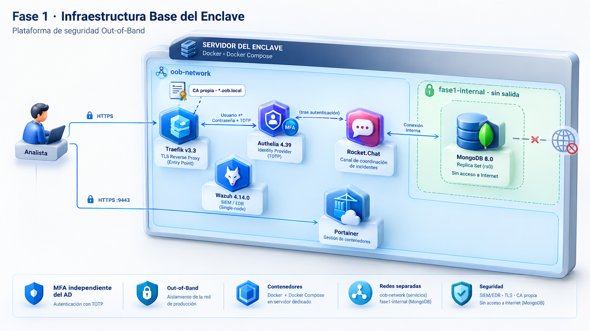
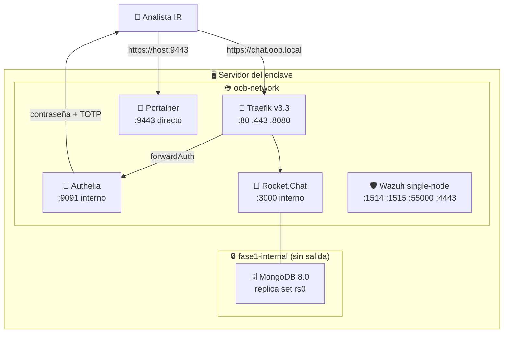

# 🏗️ Fase 1 · Infraestructura Base del Enclave

> [!NOTE]
> **🎯 Objetivo de la fase**
> Desplegar la infraestructura base del enclave out-of-band: reverse proxy con TLS, proveedor de identidad con MFA independiente del Directorio Activo, canal de comunicación para coordinación de incidentes y plataforma de detección SIEM/EDR.

> [!TIP]
> Esta fase establece los cimientos del proyecto: un entorno aislado desde el que coordinar la respuesta cuando el entorno corporativo puede estar comprometido.

---

## 📋 Estado

- [x] 🐳 Docker y Docker Compose sobre servidor dedicado
- [x] 🚦 Traefik v3.3 como punto de entrada TLS del enclave
- [x] 🧭 Portainer para gestión visual de contenedores
- [x] 🔐 Authelia 4.39 como IdP con MFA (TOTP) independiente del AD
- [x] 🗄️ MongoDB 8.0 en replica set con autenticación por keyfile
- [x] 💬 Rocket.Chat como canal de coordinación out-of-band
- [x] 🛡️ Wazuh 4.14.0 single-node para detección SIEM/EDR
- [x] 🌐 Redes Docker segmentadas (`oob-network` y `fase1-internal`)
- [x] 🔒 Rocket.Chat protegido tras Authelia con doble factor
- [x] 🏛️ CA propia del enclave sirviendo el certificado de Traefik (`*.oob.local`)
- [x] 🔗 Extensión del middleware de autenticación al resto de servicios
- [ ] 🔏 Certificados emitidos por la CA del enclave para los backends (Wazuh, MISP...)

> **Corrección (2026-09-24).** Casilla marcada. `authelia/configuration.yml:20-50`
> tiene reglas `two_factor` para `chat`, `minio`, `wazuh`, `hs`, `misp`, `iris`,
> `portainer` y `n8n`. n8n está protegido entero desde el commit `655162f`; el
> resto se añadió en los commits `6b1197e`, `4de838e` y `c5faa1c` (10-13 sep).
> Velociraptor queda fuera por decisión (`docs/DECISION-velociraptor-fuera-sso.md`).
> Medido sin sesión el 2026-09-24 (`302` hacia `auth.oob.local`) solo en `chat` y
> `n8n`; el resto consta por configuración. Ver
> `docs/MEDICION-postura-red-2026-09-23.md` §5.

---



## 🏗️ Arquitectura de la fase



> **Corrección (2026-09-24).** El diagrama describe la publicación inicial.
> Hoy el `:8080` de Traefik y el `:9443` de Portainer solo escuchan en
> `127.0.0.1` (`docker-compose.yml:20` y `:37`), y Portainer se sirve en
> `https://portainer.oob.local` con Authelia (`docker-compose.yml:49`). El
> `:4443` de Wazuh está cerrado (`wazuh/single-node/docker-compose.yml:78-81`):
> el dashboard se sirve en `https://wazuh.oob.local` con Authelia. Medido el
> 2026-09-23; ver `docs/MEDICION-postura-red-2026-09-23.md`.

> [!IMPORTANT]
> **Principio fundamental:** arquitectura Out-of-Band. Los servicios se ejecutan sobre infraestructura bajo control del operador y la autenticación no depende del Directorio Activo corporativo. Un compromiso del AD no impide a los analistas acceder al enclave.

### Segmentación de red

| Red | Tipo | Contenido | Propósito |
| --- | --- | --- | --- |
| `oob-network` | externa, compartida entre fases | Traefik, Authelia, Rocket.Chat, Portainer, Wazuh | Comunicación entre servicios del enclave y con fases posteriores |
| `fase1-internal` | interna (`internal: true`) | MongoDB | Aislamiento de la base de datos: sin ruta hacia el exterior |

MongoDB **no** está conectado a `oob-network`: solo Rocket.Chat, que pertenece a ambas redes, puede alcanzarlo. La base de datos no tiene salida a Internet ni es accesible desde otros servicios del enclave.

---

## 🔧 Componentes desplegados

| Servicio | Imagen | Acceso | Autenticación |
| --- | --- | --- | --- |
| 🚦 **Traefik** | `traefik:v3.3` | `:80` → redirige a `:443`; dashboard en `:8080` | Ninguna (ver riesgos aceptados) |
| 🔐 **Authelia** | `authelia/authelia:latest` | `https://auth.oob.local` | Contraseña + TOTP |
| 💬 **Rocket.Chat** | `registry.rocket.chat/rocketchat/rocket.chat:${ROCKETCHAT_VERSION}` | `https://chat.oob.local` | Authelia (perímetro) + credenciales propias |
| 🗄️ **MongoDB** | `mongo:8.0` | Solo red interna | Keyfile + usuario root |
| 🧭 **Portainer** | `portainer/portainer-ce:latest` | `https://<HOST>:9443` | Propia de Portainer |
| 🛡️ **Wazuh** | `wazuh/wazuh-*:4.14.0` | Dashboard en `:4443`; API en `:55000` | Propia de Wazuh |

> **Corrección (2026-09-24).** Dashboard de Traefik: solo `127.0.0.1:8080`
> (`docker-compose.yml:20`). Portainer: `127.0.0.1:9443` y
> `https://portainer.oob.local` con Authelia (`docker-compose.yml:37`, `:49`).
> Wazuh: el `:4443` ya no se publica; el dashboard está en
> `https://wazuh.oob.local`, con Authelia (`wazuh/single-node/docker-compose.yml:78-81`,
> `:116`). Medido el 2026-09-23; ver `docs/MEDICION-postura-red-2026-09-23.md`.

> **Nota de reproducibilidad:** Authelia y Portainer usan la etiqueta `latest`. Está pendiente anclarlas a una versión concreta.

---

## ⚙️ Configuración aplicada

### Variables de entorno

Crear `fase1-infraestructura/.env` (ignorado por git):

```bash
# Dominio base del enclave
ENCLAVE_DOMAIN=oob.local

# Authelia — generar cada valor con: openssl rand -hex 32
AUTHELIA_JWT_SECRET=<64 caracteres hexadecimales>
AUTHELIA_SESSION_SECRET=<64 caracteres hexadecimales>
AUTHELIA_STORAGE_ENCRYPTION_KEY=<64 caracteres hexadecimales>

# MongoDB
MONGO_INITDB_ROOT_USERNAME=rcuser
MONGO_INITDB_ROOT_PASSWORD=<contraseña robusta>

# Rocket.Chat
ROCKETCHAT_VERSION=8.4.1
ROOT_URL=https://chat.oob.local
```

### Resolución de nombres

El enclave usa el dominio `oob.local`, no resoluble públicamente. En cada equipo cliente debe añadirse al fichero de hosts:

```
<IP_DEL_SERVIDOR>  auth.oob.local
<IP_DEL_SERVIDOR>  chat.oob.local
```

Sin `auth.oob.local` el flujo de autenticación redirige a un destino inalcanzable.

### Keyfile de MongoDB

El replica set requiere un keyfile compartido, no versionado:

```bash
openssl rand -base64 756 > mongodb/mongo-keyfile
chmod 400 mongodb/mongo-keyfile
```

### Red externa

Ambas redes no se crean solas: `oob-network` está declarada como `external`, por lo que debe existir antes del primer arranque.

```bash
docker network create oob-network
```

---

## 🔐 Autenticación y control de acceso

Authelia actúa como punto de autenticación en el perímetro mediante el middleware `forwardAuth` de Traefik. El flujo es:

1. El analista solicita `https://chat.oob.local`.
2. Traefik consulta a Authelia mediante `forwardAuth` antes de enrutar.
3. Si no hay sesión válida, Authelia redirige a `https://auth.oob.local`.
4. El analista se autentica con contraseña y código TOTP.
5. Authelia devuelve las cabeceras `Remote-User`, `Remote-Groups`, `Remote-Name` y `Remote-Email`, y Traefik enruta la petición.

### Política de acceso

```yaml
access_control:
  default_policy: deny
  rules:
    - domain: 'chat.oob.local'
      subject: 'group:ir_lead'
      policy: two_factor
```

La política por defecto es **denegar**. Solo los usuarios del grupo `ir_lead` acceden a Rocket.Chat, y siempre con doble factor.

> **Corrección (2026-09-24).** El extracto muestra la regla inicial. La
> configuración vigente (`authelia/configuration.yml:20-50`) aplica la misma
> política (`group:ir_lead`, `two_factor`) a `chat`, `minio`, `wazuh`, `hs`,
> `misp`, `iris`, `portainer` y `n8n`.

### Cableado del middleware

```yaml
- "traefik.http.routers.rocketchat.middlewares=authelia@file"
```

### Registro del segundo factor

El notificador de Authelia es de tipo `filesystem`: los enlaces de alta de dispositivo no se envían por correo, se escriben en `authelia/notification.txt`. Para registrar un dispositivo TOTP hay que solicitar el alta desde el perfil de usuario y recuperar la URL de ese fichero.

> [!WARNING]
> Los códigos de recuperación deben guardarse fuera del servidor. Sin ellos, la pérdida del dispositivo TOTP obliga a eliminar `authelia/db.sqlite3`, lo que borra también todas las sesiones activas.

### Doble credencial en Rocket.Chat

El acceso a Rocket.Chat requiere dos autenticaciones independientes: Authelia en el perímetro y las credenciales propias de la aplicación. Rocket.Chat no consume las cabeceras que Authelia emite, por lo que no hay inicio de sesión único.

Se evaluó unificarlas mediante OpenID Connect, con Authelia como proveedor de identidad, y se descartó para esta iteración por el riesgo de pérdida de acceso a la instancia durante la configuración. La separación actual constituye **defensa en profundidad**: el compromiso de una capa no concede acceso a la otra. La federación OIDC queda propuesta como trabajo futuro.

### Cuentas de servicio

El usuario `orchestrator-bot` es la cuenta empleada por el orquestador para publicar en Rocket.Chat. Requiere un tratamiento distinto al de las cuentas humanas: al no disponer de buzón de correo ni de navegador, no puede completar desafíos interactivos de doble factor. Su token de acceso personal se genera con la opción de omisión de 2FA.

> [!NOTE]
> **Lección aprendida:** durante la validación de esta fase, la activación de políticas de doble factor invalidó silenciosamente el token de la cuenta de servicio, interrumpiendo la publicación de alertas sin generar ningún error visible. En un sistema cuyo propósito es notificar incidentes, un fallo silencioso del canal de notificación es el modo de fallo más grave posible. Se identifica como trabajo futuro la verificación periódica de la capacidad de notificación del sistema.

---

## ✅ Validación funcional

### Estado de los servicios

```bash
cd fase1-infraestructura
docker compose ps --format "table {{.Name}}\t{{.Status}}"
```

Salida esperada: `traefik`, `portainer`, `authelia`, `mongodb` y `rocketchat` en estado `Up`; `authelia` y `mongodb` además como `healthy`.

### Segmentación de red

```bash
docker network inspect oob-network --format '{{range .Containers}}{{println .Name}}{{end}}'
docker network inspect fase1-internal --format '{{range .Containers}}{{println .Name}}{{end}}'
```

`mongodb` debe aparecer únicamente en `fase1-internal`.

### Replica set de MongoDB

```bash
docker compose exec mongodb mongosh --quiet \
  -u "$MONGO_INITDB_ROOT_USERNAME" -p "$MONGO_INITDB_ROOT_PASSWORD" \
  --authenticationDatabase admin --eval "rs.status().ok"
```

Resultado esperado: `1`.

### Alcance de Authelia desde Traefik

```bash
docker compose exec traefik wget -qO- http://authelia:9091/api/health
```

### Flujo de autenticación

Desde una ventana de navegación privada, acceder a `https://chat.oob.local`. El comportamiento esperado es la redirección a `auth.oob.local`, la solicitud de contraseña y código TOTP, y el retorno a Rocket.Chat.

Accediendo directamente a `https://auth.oob.local`, tras autenticarse el destino por defecto es `chat.oob.local`.

> [!NOTE]
> El navegador en modo privado comparte sesión entre ventanas. Para validar el flujo completo deben cerrarse todas las ventanas privadas antes de cada prueba.

### Acceso a los servicios

| Servicio | URL | Protegido por Authelia |
| --- | --- | --- |
| Rocket.Chat | `https://chat.oob.local` | ✅ Sí |
| Authelia | `https://auth.oob.local` | — |
| Portainer | `https://<HOST>:9443` | ❌ No |
| Traefik dashboard | `http://<HOST>:8080` | ❌ No |
| Wazuh dashboard | `https://<HOST>:4443` | ❌ No |

> **Corrección (2026-09-24).** Estado actual:
>
> | Servicio | URL | Protegido por Authelia |
> | --- | --- | --- |
> | Portainer | `https://portainer.oob.local` (el `:9443` solo en `127.0.0.1`) | ✅ Sí, por configuración (`docker-compose.yml:49`) |
> | Traefik dashboard | `http://127.0.0.1:8080`, solo desde el host | ❌ No (`docs/DECISION-dashboard-traefik.md`) |
> | Wazuh dashboard | `https://wazuh.oob.local` (`:4443` cerrado) | ✅ Sí, por configuración (`wazuh/single-node/docker-compose.yml:116`) |
>
> Puertos medidos el 2026-09-23. La redirección a Authelia de Portainer y Wazuh
> no se ha medido (D-6). Ver `docs/MEDICION-postura-red-2026-09-23.md`.

Ni Rocket.Chat ni Authelia publican puertos en el host: solo son accesibles a través de Traefik por nombre de dominio.

---

## ⚠️ Consideraciones de seguridad

### Medidas aplicadas

- 🔐 **MFA independiente del AD:** los analistas se autentican aunque el Directorio Activo esté comprometido.
- 🚫 **Política de denegación por defecto:** solo los grupos declarados explícitamente obtienen acceso.
- 🔒 **Aislamiento de la base de datos:** MongoDB reside en una red interna sin salida.
- 🛡️ **`no-new-privileges`** activado en Traefik y Portainer.
- 🔑 **Autenticación por keyfile** en el replica set de MongoDB.
- 🏛️ **CA propia del enclave** (`traefik/generate-oob-ca.sh`): Traefik sirve un certificado `*.oob.local` emitido por esta CA como certificado por defecto (`traefik/dynamic/tls.yml`), en lugar de `TRAEFIK DEFAULT CERT` — el certificado de relleno no verificable que forzaba a desactivar la comprobación TLS en los clientes que hablan con el enclave (ver Fase 2).
- 📄 **Secretos fuera del control de versiones:** `.env`, keyfile, base de datos de Authelia y certificados están excluidos por `.gitignore`.

### Riesgos aceptados

Las siguientes decisiones se apartan de la configuración recomendada para producción. Se documentan de forma explícita junto a su justificación en el contexto de un laboratorio académico.

| Riesgo | Justificación | Mitigación en producción |
| --- | --- | --- |
| **Verificación TLS de backend desactivada** (`serversTransport.insecureSkipVerify: true`) | La CA propia del enclave (`generate-oob-ca.sh`) ya emite el certificado que Traefik presenta a los clientes (`*.oob.local`), pero los backends —en particular el dashboard de Wazuh, cuyos certificados genera el propio indexer— siguen presentando certificados autofirmados no emitidos por esa CA. Con verificación activa, Traefik rechazaría esas conexiones internas. | Emitir certificados para cada backend desde la CA del enclave y retirar la excepción global, acotándola como mucho al transporte nombrado de Wazuh mientras dure la migración. |
| **Dashboard de Traefik sin autenticación** (`api.insecure: true`, puerto 8080) | Acceso directo al estado de routers y servicios durante el desarrollo del laboratorio, sin depender de que la cadena de autenticación esté operativa. | Enrutar el dashboard a través de Traefik con el middleware de Authelia, o deshabilitar la publicación del puerto. |
| **Portainer publicado directamente en `:9443`** | Mantener una herramienta de diagnóstico de contenedores accesible aunque Traefik o Authelia fallen. Un fallo en la cadena de autenticación no debe impedir el diagnóstico de la propia infraestructura. | Enrutar por Traefik con Authelia, manteniendo un procedimiento documentado de acceso de emergencia. |

> **Corrección (2026-09-24).** Las dos filas anteriores describen la
> publicación inicial. El 8080 (con `api.insecure` todavía activo) y el 9443
> solo escuchan en `127.0.0.1` (`docker-compose.yml:20`, `:37`; medido el
> 2026-09-23, ver `docs/MEDICION-postura-red-2026-09-23.md`). Portainer además
> se enruta por Traefik con Authelia (commit `4de838e`). La decisión sobre el
> dashboard está en `docs/DECISION-dashboard-traefik.md`.
| **Montaje de `docker.sock`** en Traefik y Portainer | Traefik lo requiere para el descubrimiento dinámico de servicios y Portainer para su función. Está montado en solo lectura. | Interponer un proxy de socket Docker que limite las operaciones permitidas. El montaje en solo lectura no impide la escalada a root del host. |

### Deuda técnica identificada

- ~~**`authelia/users_database.yml` está versionado** pese a figurar en `.gitignore`, ya que la regla no afecta a ficheros previamente añadidos al índice. Debe retirarse con `git rm --cached` y sustituirse por un fichero de ejemplo.~~ **Corrección (2026-09-24):** ya no está versionado. Se retiró del índice en el commit `4417467` (2026-08-20) y `git ls-files fase1-infraestructura/authelia/` no lo lista. El fichero de ejemplo sigue sin existir.
- ~~**Contraseña de MongoDB incrustada** en el `healthcheck` del `docker-compose.yml`. Debe sustituirse por una referencia a variable de entorno.~~ **Resuelto (2026-09-23):** el healthcheck usa `${MONGO_INITDB_ROOT_PASSWORD}`, verificado con `healthy` tras recrear; credencial rotada. Ver `docs/HALLAZGO-credencial-mongodb-2026-09-23.md`.
- ~~**Middleware `secure-headers` definido pero no aplicado.**~~ Contiene además la directiva `sslRedirect`, obsoleta en Traefik v3. **Corrección (2026-09-24):** sí está aplicado, en Portainer (`docker-compose.yml:49`) y en los routers de Wazuh, MinIO, Velociraptor, MISP, IRIS, Headscale UI y KVM (`git grep secure-headers@file`). La directiva `sslRedirect` sigue en `traefik/dynamic/middlewares.yml:5`.
- **Etiquetas `latest`** en Authelia y Portainer.

---

## 🚀 Próximos pasos

1. 🧭 Desplegar el orquestador n8n e integrarlo con Wazuh y Rocket.Chat (Fase 2).
2. 🤖 Incorporar el triage asistido por IA agéntica (Fase 3).
3. 🌐 Establecer conectividad out-of-band con los controladores de dominio mediante Headscale (Fase 4).
4. 🔒 Extender el middleware de Authelia al resto de servicios del enclave.
5. 🔏 Emitir certificados de la CA del enclave para los backends (Wazuh, MISP...) y retirar `serversTransport.insecureSkipVerify` global.

---

## 📚 Documentación detallada

| Subfase | Documento |
| --- | --- |
| 1a | [Traefik y Portainer](../docs/README-fase1a-traefik-portainer.md) |
| 1b | [Authelia · MFA e IdP](../docs/README-fase1b-authelia.md) |
| 1c | [MongoDB y Rocket.Chat](../docs/README-fase1c-mongodb-rocketchat.md) |
| 1d | [Wazuh single-node](../docs/README-fase1d-wazuh.md) |
| 1e | [Validación final](../docs/README-fase1e-validacion.md) |
