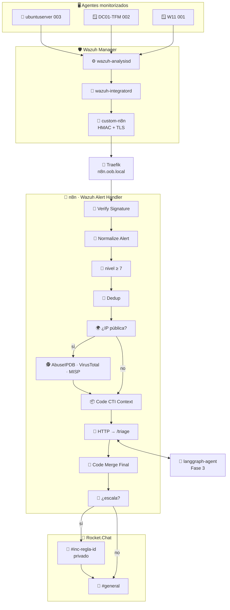
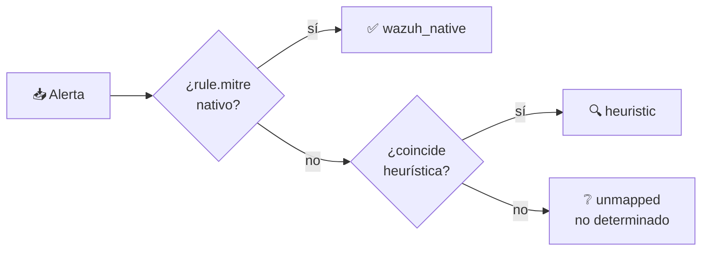
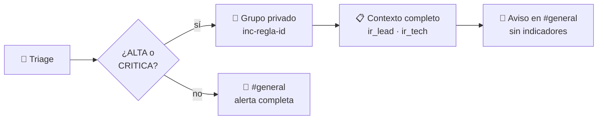

# 🔄 Fase 2 · Orquestador de Alertas del Enclave

> [!NOTE]
> **🎯 Objetivo de la fase**
> Orquestar el ciclo completo de alerta temprana: ingesta autenticada de alertas de Wazuh, enriquecimiento con inteligencia de amenazas, triage automatizado y coordinación de la respuesta en Rocket.Chat, todo dentro del enclave y sin depender de infraestructura corporativa.

> [!TIP]
> Esta fase convierte la detección de la Fase 1 en respuesta: una alerta deja de ser una línea en un panel para convertirse en un incidente clasificado, enriquecido y con un canal de coordinación abierto.

> [!WARNING]
> **Sustituye a la versión anterior de este documento.** El README previo describía una arquitectura basada en FastAPI, PostgreSQL y Redis, con modelo de datos relacional y API REST propia. Esa arquitectura nunca llegó a implementarse.

---

## 📋 Estado

- [x] 🔗 Integración `custom-n8n` registrada y operativa en `wazuh-integratord`
- [x] 🔐 Firma HMAC-SHA256 del canal de ingesta con verificación en tiempo constante
- [x] 🔒 Verificación TLS contra la CA del enclave (sustituye a `CERT_NONE`)
- [x] 🧹 Normalización defensiva de alertas sin `data.srcip`
- [x] 🔁 Deduplicación con ventana de 15 minutos
- [x] 🌍 Enriquecimiento CTI condicional (AbuseIPDB · VirusTotal · MISP)
- [x] 🧠 Triage con motor seleccionable (`deterministic` · `llm` · `hybrid`)
- [x] 🎯 Atribución MITRE ATT&CK desde el ruleset nativo de Wazuh
- [x] 🚪 War Room privado por incidente con anuncio en `#general`
- [x] 📌 Imagen de n8n anclada por digest
- [x] 📵 Telemetría saliente desactivada
- [ ] 🔏 Retirada de `allowUnauthorizedCerts` en el nodo MISP
- [ ] 📊 Instrumentación de métricas de latencia (Fase 7)

---

## 🏗️ Arquitectura de la fase



> [!IMPORTANT]
> **Principio fundamental:** el motor de triage vive fuera de n8n, como servicio HTTP independiente en la Fase 3. n8n no conoce qué motor decide: invoca `/triage` y recibe siempre el mismo contrato. Eso permite alternar entre motor determinista y LLM sin tocar el workflow.

### 🔧 Componentes

| Servicio | Imagen | Papel |
| --- | --- | --- |
| 🔄 **n8n** | `docker.n8n.io/n8nio/n8n` · anclada por digest | Orquestador del pipeline |
| 🤖 **langgraph-agent** | build local (Fase 3) | Motor de triage |
| 🦙 **Ollama** | `ollama/ollama` | Inferencia local · modo opcional |
| 💬 **Rocket.Chat** | Fase 1 | Coordinación out-of-band |
| 🚦 **Traefik** | `traefik:v3.3` | Entrada TLS con CA del enclave |
| 🕵️ **MISP** | `misp-docker` | CTI local |

---

## 📥 Ingesta desde Wazuh

### Registro de la integración

```xml
<integration>
  <name>custom-n8n</name>
  <hook_url>https://n8n.oob.local/webhook/wazuh-alerts</hook_url>
  <level>7</level>
  <alert_format>json</alert_format>
</integration>
```

> [!CAUTION]
> `wazuh-integratord` **no arranca** si no encuentra ningún bloque `<integration>` válido: registra `Remote integrations not configured. Clean exit.` y termina sin error visible. El bloque se pierde en las recreaciones del contenedor. Comprobar siempre tras un `--force-recreate`:
> ```bash
> docker exec single-node-wazuh.manager-1 /var/ossec/bin/wazuh-control status | grep integrator
> ```

### 📜 El script de integración

Se monta como **bind mount** desde el repositorio. Las copias con `docker cp` no sobreviven a `docker compose up --force-recreate`.

| Función | Detalle |
| --- | --- |
| 🔒 **Verificación TLS** | Contra la CA del enclave vía `CA_BUNDLE` |
| 🔐 **Firma HMAC-SHA256** | Cabecera `X-OOB-Signature` |
| 🔁 **Reintentos** | Tres intentos con espera incremental |
| 🕐 **Marca de ingesta** | `datetime.now(timezone.utc)`, con zona explícita |
| 📝 **Registro** | `/var/ossec/logs/integrations.log` |

> [!NOTE]
> **Compromiso de permisos.** El script requiere modo `755`. Wazuh recomienda `750 root:wazuh`, pero el bind mount hereda la propiedad del host (`uid 1000`) mientras que `wazuh-integratord` corre como `uid 999`: con `750` el demonio cae en «otros» y no puede ejecutarlo. El script no contiene secretos — viven en `n8n-integration.conf`, que sí está en `640 root:wazuh`.

### 🌐 Conectividad

```yaml
    extra_hosts:
      - "n8n.oob.local:host-gateway"
```

> [!WARNING]
> Sin esto, `n8n.oob.local` resuelve a `127.0.0.1` dentro del contenedor y la entrega falla siempre. Con `CERT_NONE`, este fallo de conectividad se manifestaba como un error TLS genérico, lo que ocultó durante todo el desarrollo que la integración **nunca había entregado una alerta**.

---

## 🔐 Seguridad del canal de ingesta

### Autenticación por HMAC

El endpoint aceptaba originalmente cualquier petición. Sin autenticación, cualquiera con acceso de red podía inyectar alertas falsas y —más sutil— forzar consultas salientes a VirusTotal y AbuseIPDB con direcciones elegidas, agotando la cuota diaria y revelando el foco de atención del SOC.

```javascript
const a = Buffer.from(received, 'utf8');
const b = Buffer.from(expected, 'utf8');
if (a.length !== b.length || !crypto.timingSafeEqual(a, b)) {
  throw new Error('Firma HMAC invalida: alerta descartada');
}
```

> [!TIP]
> La comparación en **tiempo constante** no es cosmética: un `===` filtra información sobre el prefijo correcto de la firma y permite reconstruirla byte a byte.

Requisitos en el entorno de n8n:

```yaml
      - NODE_FUNCTION_ALLOW_BUILTIN=crypto
      - N8N_BLOCK_ENV_ACCESS_IN_NODE=false
```

Y **Raw Body activado** en el nodo `Webhook`: el script firma los bytes exactos que envía; firmar sobre una reserialización alteraría separadores y orden de claves.

### 💉 Inyección indirecta de prompt

> [!IMPORTANT]
> `rule.description` y otros campos proceden de registros y pueden contener **texto controlado por un atacante** — el nombre de usuario de un intento de autenticación fallido, por ejemplo. En modo LLM esos campos llegan literalmente al contexto del modelo.

Una inyección buscaría rebajar la severidad y desactivar el bloqueo. La defensa está en `fase3-agentic/app/tools.py`:

```python
if downgrade > MAX_SEVERITY_DOWNGRADE:
    # Se conserva la severidad determinista y se registra el intento.
```

Escalar siempre se permite; rebajar más de un nivel respecto al motor determinista invalida el veredicto del modelo.

### 🏛️ PKI del enclave (Fase 1)

Traefik servía `TRAEFIK DEFAULT CERT`, un certificado de relleno cuyo CN no corresponde a ningún nombre de host y que se regenera en cada reinicio. Ningún cliente podía verificarlo, lo que obligaba a desactivar la verificación TLS **en cadena**:

| Apaño | Ubicación |
| --- | --- |
| `ssl.CERT_NONE` | Script de integración de Wazuh |
| `allowUnauthorizedCerts` | Nodo MISP de n8n |
| `insecureSkipVerify` | Traefik, global |

Tres síntomas, una causa raíz.

> [!IMPORTANT]
> Un enclave out-of-band **no puede apoyarse en la PKI corporativa**: si el Directorio Activo está comprometido, su autoridad certificadora también lo está. La confianza criptográfica debe originarse dentro del enclave, igual que su plano de red y su autenticación.

`fase1-infraestructura/traefik/generate-oob-ca.sh` genera la CA y el certificado `*.oob.local`.

---

## 🧹 Normalización y deduplicación

### Normalize Alert

Sustituye al nodo `Edit Fields` original, que evaluaba `{{ $json.body.data.srcip }}` sin guarda.

> [!CAUTION]
> Las alertas de integridad (regla 550, nivel 7) **no tienen clave `data`**. La expresión lanzaba excepción y la ejecución moría en el segundo nodo. Como esas alertas se generan de forma rutinaria, la mayor parte del tráfico real no llegaba a notificarse.

El nodo además:

- 🌍 Detecta direcciones no enriquecibles (RFC1918, loopback, link-local, CGNAT)
- 🕐 Separa `event_timestamp` (hora del evento en Wazuh) de `ingest_timestamp` (entrada al enclave)
- 🎯 Propaga `rule.mitre` nativo de Wazuh

> [!NOTE]
> La plantilla anterior mostraba `$now`: la hora de **notificación**, no la del evento. El único registro legible por humanos perdía el instante del incidente — relevante para la cadena de custodia.

### 🔁 Deduplicación

```javascript
const objetivo = w.src_ip || w.syscheck_path || w.alert_id || '';
const clave = `${w.rule_id}|${w.agent_name}|${objetivo}`;
```

> [!TIP]
> **El discriminante importa.** Una clave basada solo en `src_ip` colapsa todas las alertas de integridad del mismo agente y regla en una sola entrada: una modificación de `/etc/passwd` quedaría suprimida por otra anterior en un fichero irrelevante. La identidad del incidente depende del tipo de alerta.

---

## 🕵️ Enriquecimiento CTI

| Fuente | Endpoint | Notas |
| --- | --- | --- |
| 🔴 **AbuseIPDB** | API pública | Externa al enclave |
| 🦠 **VirusTotal** | API v3 | 500 peticiones/día · 4/min |
| 🟢 **MISP** | `https://misp/attributes/restSearch` | Local, red interna |

### 🐛 Correcciones aplicadas

<details>
<summary><b>🔴 El nodo MISP nunca funcionó</b></summary>

Apuntaba a `https://misp:443`, que no es un endpoint: un POST contra la raíz devuelve HTML. Los apaños de decodificación de entidades HTML (`&quot;`, `&lt;`) presentes en el código original eran el síntoma. Los valores observados en las pruebas procedían de los payloads sintéticos inyectados manualmente.
</details>

<details>
<summary><b>🟠 El enriquecimiento debe condicionarse</b></summary>

Una consulta a MISP con `value` vacío no devuelve error, sino **atributos arbitrarios**. En una alerta de integridad sin IP origen, esos resultados inflaban el score dos puntos y provocaban una escalada infundada con apertura de War Room.
</details>

<details>
<summary><b>🟡 <code>$('Nodo').first()</code> lanza excepción si el nodo no se ejecutó</b></summary>

El encadenamiento opcional no protege, porque el error se produce antes de evaluarlo. `Code CTI Context` envuelve cada acceso en `try/catch`.
</details>

<details>
<summary><b>🔵 <code>last_analysis_stats</code> frente a <code>total_votes</code></b></summary>

El objeto IP de VirusTotal v3 contiene **ambos** y significan cosas distintas: detecciones de motores antivirus frente a votos de la comunidad. Se usan motores, y así se etiqueta. La documentación previa afirmaba que `last_analysis_stats` no existía para IPs, lo cual es incorrecto.
</details>

### 🛟 Tolerancia a fallos

Los tres nodos HTTP llevan `On Error → Continue`, `Retry On Fail` y `Always Output Data`.

> [!WARNING]
> Sin ello, un 404 de VirusTotal ante una IP reservada o el agotamiento de la cuota diaria mataba la ejecución completa: **un fallo del enriquecimiento impedía la notificación del incidente**. Un sistema de alerta temprana no debe fallar cerrado en el canal de aviso.

---

## 🧠 Triage · Motor seleccionable

### El problema de atribución

> [!CAUTION]
> El mensaje publicado rezaba `Análisis IA Agéntica (LangGraph + Mistral 7B)`. **No era cierto.**

| Hallazgo | Detalle |
| --- | --- |
| 👻 Nodo huérfano | `AI Agent` + `Ollama Chat Model` + `Simple Memory` sin entrada ni salida `main` |
| ⚙️ Motor real | Heurística determinista pura en `langgraph-agent` |
| 📦 Dependencia muerta | `langchain-ollama` en `requirements.txt`, nunca importado |
| 🔌 Variables ignoradas | `OLLAMA_BASE_URL` declarada, nunca leída |

Además, alojar el LLM en un nodo de n8n hacía **bypass del grafo LangGraph** por completo: el grafo nunca veía el modelo.

### Los tres modos

| Modo | Comportamiento | Uso |
| --- | --- | --- |
| ⚡ `deterministic` | Motor de reglas. Reproducible y auditable | **Por defecto** |
| 🦙 `llm` | Mistral 7B decide, sujeto al guardrail | Experimental |
| 🔀 `hybrid` | El modelo redacta; las reglas fijan severidad y flags | Análisis diferido |

> [!IMPORTANT]
> El servicio devuelve `analysis_mode` con el motor que **realmente** decidió, y la plantilla de Rocket.Chat lo renderiza. Así el informe no puede volver a atribuir a un modelo un veredicto producido por reglas, ni siquiera si alguien cambia la configuración sin actualizar la documentación.

Ante fallo, timeout o esquema inválido, el grafo degrada y lo declara: `deterministic (degradado desde hybrid)`.

### 🎯 Atribución MITRE ATT&CK

Wazuh entrega el mapeo en la propia alerta:

```json
"mitre": { "id": ["T1565.001"], "tactic": ["Impact"], "technique": ["Stored Data Manipulation"] }
```

El pipeline lo **descartaba** y lo reconstruía con un condicional de dos ramas cuyo `else` asignaba `T1078 Valid Accounts` a cualquier alerta no reconocida. La regla 5710 («Attempt to login using a non-existent user») no contiene la cadena «brute force», de modo que los fallos de autenticación SSH acababan clasificados como uso de credenciales válidas.

> [!IMPORTANT]
> El problema de fondo no era el mapeo sino **el fallback**: emitir una técnica ATT&CK concreta para una alerta desconocida es *fabricar atribución*, y eso es peor que la ausencia de dato.

Precedencia actual:



El campo `mitre_source` viaja hasta el mensaje: el analista sabe si la atribución procede del ruleset o de una inferencia propia.

### ⏱️ Rendimiento medido

Hardware: **32 vCPU, sin GPU**. Medidas indicativas sobre la misma alerta.

| Modo | Latencia del pipeline completo |
| --- | --- |
| ⚡ `deterministic` | **~3 s** (dominado por las llamadas CTI) |
| 🔀 `hybrid` (mistral:7b) | **~50 s** |

> [!WARNING]
> Bajo carga concurrente el modo LLM no solo es lento sino **impredecible**: con `OLLAMA_NUM_PARALLEL=1` las peticiones se encolan y la latencia crece de forma acumulativa. En un SOC donde las alertas llegan en ráfagas, eso lo descarta del camino crítico.

> [!IMPORTANT]
> **Conclusión de diseño:** en un enclave OOB sin GPU, la inferencia con LLM no es viable para el camino crítico de notificación. El motor determinista no es una limitación sino la elección correcta: reproducible, auditable y con desglose de score justificable término a término. El LLM queda como modo opcional para análisis diferido.

---

## 🚪 Coordinación en Rocket.Chat

### War Room por incidente



> [!TIP]
> La separación es deliberada: el canal privado contiene indicadores, direcciones y decisiones de respuesta, que no todo el enclave debe ver; el canal general deja **traza** sin exponer el detalle.

El nombre se sanea porque `alert_id` de Wazuh tiene forma `1787305487.1121` y Rocket.Chat no admite puntos en nombres de canal.

### 🔀 Plano humano frente a plano de automatización

| Plano | Ruta | Autenticación |
| --- | --- | --- |
| 👤 **Humano** | `https://chat.oob.local` | Authelia + TOTP |
| 🤖 **Automatización** | `http://rocketchat:3000` | Token de servicio |

> [!NOTE]
> Wazuh y n8n no pueden completar un flujo MFA. Por eso el compose de n8n define **dos routers**: la interfaz de usuario protegida con Authelia, y el path del webhook fuera de Authelia pero con firma HMAC y restricción de origen.

---

## 🚀 Despliegue

```bash
# 1️⃣ CA del enclave (Fase 1, una sola vez)
cd fase1-infraestructura/traefik
bash generate-oob-ca.sh
docker compose up -d --force-recreate traefik

# 2️⃣ Motor de triage (Fase 3)
cd fase3-agentic
cp .env.example .env && nano .env      # TRIAGE_MODE, OS_PASS
docker compose up -d --build

# 3️⃣ Orquestador
cd fase2-orquestador/n8n
cp .env.example .env && nano .env      # N8N_ENCRYPTION_KEY, OOB_WEBHOOK_SECRET
docker compose up -d

# 4️⃣ Integración en el manager de Wazuh
CA=fase1-infraestructura/traefik/certs/oob-rootCA.crt
docker cp "$CA" single-node-wazuh.manager-1:/var/ossec/etc/oob-rootCA.crt
# + n8n-integration.conf con el mismo OOB_WEBHOOK_SECRET
# + bloque <integration> en ossec.conf
docker exec single-node-wazuh.manager-1 /var/ossec/bin/wazuh-control restart

# 5️⃣ Workflow
docker cp workflows/wazuh-alert-handler.json n8n:/tmp/w.json
docker exec n8n n8n import:workflow --input=/tmp/w.json
docker restart n8n
```

> [!CAUTION]
> Tras importar el workflow hay que **reasignar las credenciales a mano**: el export de n8n conserva referencias por ID, y los identificadores se regeneran en cada instancia.

### ✅ Verificación

```bash
# 🔒 TLS del enclave
curl --cacert "$CA" -o /dev/null -w "%{http_code}\n" https://n8n.oob.local/

# 🔗 Integratord activo
docker exec single-node-wazuh.manager-1 /var/ossec/bin/wazuh-control status | grep integrator

# 🧠 Motor de triage
docker exec n8n wget -qO- http://langgraph-agent:8000/health

# 🔄 Ciclo completo
echo "# test $(date)" | sudo tee -a /etc/hosts.allow
docker exec single-node-wazuh.manager-1 tail -5 /var/ossec/logs/integrations.log
```

---

## ✅ Validación funcional

Verificado sobre **tráfico real de Wazuh**, no sobre payloads sintéticos:

| Caso | Resultado |
| --- | --- |
| 🔴 Alerta SSH (5710, nivel 10, IP pública) | CRITICA · `T1110 - Brute Force` · War Room abierto |
| 🟡 Alerta FIM (550, nivel 7, sin `srcip`) | MEDIA · `T1565.001` nativo · CTI omitido · sin War Room |
| 🔁 Repetición dentro de la ventana | Suprimida en `Dedup` |
| 🚫 Alerta sin firma HMAC | Rechazada en `Verify Signature` |
| 🚫 Firma HMAC inválida | Rechazada en `Verify Signature` |
| 🔄 Ciclo agente → Rocket.Chat | Verificado de extremo a extremo |

> [!IMPORTANT]
> **Sobre la validación previa.** Las pruebas documentadas en las fases 2c–2f se realizaron con `curl` desde el host y payloads construidos a mano. No podía ser de otro modo: `wazuh-integratord` no estaba corriendo y `n8n.oob.local` resolvía a `127.0.0.1` dentro del manager, de forma que el camino real nunca funcionó. Es una diferencia cualitativa relevante y se declara explícitamente.

---

## ⚠️ Consideraciones de seguridad

### 🛡️ Medidas aplicadas

- 🔐 Autenticación HMAC-SHA256 del canal de ingesta con comparación en tiempo constante
- 🔒 Verificación TLS contra CA propia del enclave
- 🧯 Guardrail antidegradación de severidad frente a inyección indirecta de prompt
- 🔑 Secretos fuera del control de versiones (`.env`, `n8n-integration.conf`)
- 📌 Imagen de n8n anclada por digest
- 📵 Telemetría y comprobación de versiones desactivadas
- 🗄️ Retención acotada del historial de ejecuciones (contiene datos del incidente)

### 🟠 Riesgos aceptados

| Riesgo | Justificación |
| --- | --- |
| `allowUnauthorizedCerts` en nodo MISP | MISP presenta certificado propio por red interna, no el de Traefik. Acotado a `oob-network` |
| `insecureSkipVerify` global en Traefik | Backends con certificados autofirmados. Pendiente de emisión desde la CA del enclave |
| `N8N_BLOCK_ENV_ACCESS_IN_NODE=false` | Expone **todas** las variables de entorno a cualquier nodo Code, incluida `N8N_ENCRYPTION_KEY`. Aceptable con un único operador; inaceptable en multiusuario |
| AbuseIPDB y VirusTotal en la nube | Contradice la independencia del enclave. Degradables: su caída reduce la calidad del enriquecimiento sin impedir la notificación |

### 🔧 Deuda técnica identificada

<details>
<summary><b>🔁 Deduplicación</b></summary>

El estado vive en memoria del proceso y se pierde al reiniciar el contenedor. Amortigua ráfagas pero no correlaciona a lo largo del tiempo. Además, una ventana fija suprime repeticiones legítimas de un ataque persistente: un diseño de producción notificaría la primera y luego una cada N repeticiones.
</details>

<details>
<summary><b>♻️ Reproducibilidad</b></summary>

- El export de n8n conserva referencias a credenciales **por ID**, no los secretos. Los identificadores se regeneran en cada instancia, por lo que restaurar exige reasignarlas manualmente en cada nodo.
- Rotar `N8N_ENCRYPTION_KEY` requiere exportar credenciales en claro, editar `/home/node/.n8n/config` dentro del volumen y reimportar. Hay una **ventana de exposición**.
</details>

<details>
<summary><b>📡 Modo de respuesta del webhook</b></summary>

En `onReceived`, n8n responde 200 antes de ejecutar el flujo: el rechazo por firma inválida aparece en el historial de ejecuciones, no en el código HTTP. `Last Node` propaga el error pero bloquea al manager hasta que termina el pipeline — inasumible en modo LLM.
</details>

<details>
<summary><b>🔑 Credenciales y configuración</b></summary>

- `config/wazuh_dashboard/wazuh.yml` contiene la contraseña de la API del manager y no admite sustitución de variables. Excluido del control de versiones, con `.example` en su lugar.
- La contraseña de la API de Wazuh debe cumplir su política (8–64 caracteres con mayúscula, minúscula, número y símbolo de `.*+?-`). Si no la cumple, `create_user.py` falla y **el manager entero no arranca**, sin mensaje visible salvo en los logs del contenedor.
- Nueve servicios del proyecto siguen con etiqueta `:latest`.
</details>

<details>
<summary><b>🌐 Aislamiento y funcionalidad</b></summary>

El detector de vulnerabilidades y el comprobador de actualizaciones de Wazuh requieren salida a Internet y quedan inoperativos por diseño (`Could not resolve hostname` en `ossec.log`). Es **evidencia del aislamiento**, no un defecto.
</details>

---

## 📁 Estructura

```
fase2-orquestador/
├── 📄 README.md
├── 📄 CAMBIOS-WORKFLOW-N8N.md          Registro de cambios del workflow
├── 📁 n8n/
│   ├── 🐳 docker-compose.yml           Digest anclado · dos routers · sin telemetría
│   ├── 🔑 .env.example
│   ├── 📜 export-workflow.sh           Export saneado
│   ├── 📁 certs/misp.crt
│   └── 📁 workflows/
│       └── 🔄 wazuh-alert-handler.json Credenciales a REEMPLAZAR
├── 📁 ollama/
│   └── 🐳 docker-compose.yml
└── 📁 wazuh-integration/
    ├── 📜 custom-n8n                   Script de integración
    ├── 🔑 n8n-integration.conf.example
    └── 📄 ossec-integration.xml
```

---

## 🚀 Próximos pasos

- [ ] 🔏 Emitir certificado de MISP desde la CA del enclave y retirar `allowUnauthorizedCerts`
- [ ] 🔒 Sustituir `insecureSkipVerify` global de Traefik por verificación contra la CA
- [ ] 📊 Instrumentar métricas de latencia y tasa de deduplicación (Fase 7)
- [ ] 🔁 Supresión con recuento en lugar de ventana fija
- [ ] 📌 Anclar por digest los nueve servicios restantes

---

## 📚 Documentación detallada

| Documento | Contenido |
| --- | --- |
| 📄 `CAMBIOS-WORKFLOW-N8N.md` | Cambios del workflow con su justificación |
| 🏛️ `fase1-infraestructura/traefik/generate-oob-ca.sh` | CA del enclave |
| ⚙️ `fase3-agentic/app/config.py` | Selector `TRIAGE_MODE` |
| 🎯 `fase3-agentic/app/tools.py` | Scoring, ATT&CK y guardrails |
| 🦙 `fase3-agentic/app/llm.py` | Cliente Ollama y validación de esquema |
