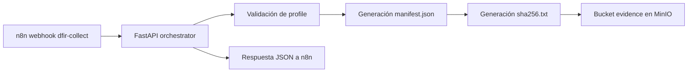

# 🧠 fase5-orchestrator-api

> Microservicio **FastAPI** encargado de orquestar la recolección forense de la **Fase 5** del proyecto `tfm-alerta-temprana-oob`, validando perfiles permitidos, generando el `manifest.json`, calculando `sha256.txt` y persistiendo ambos en **MinIO**.

---

## 📌 Índice

- [1. Objetivo](#-1-objetivo)
- [2. Rol en la arquitectura](#-2-rol-en-la-arquitectura)
- [3. Estructura del componente](#-3-estructura-del-componente)
- [4. Endpoint principal](#-4-endpoint-principal)
- [5. Perfiles permitidos](#-5-perfiles-permitidos)
- [6. Variables de entorno](#-6-variables-de-entorno)
- [7. Docker Compose](#-7-docker-compose)
- [8. Flujo de procesamiento](#-8-flujo-de-procesamiento)
- [9. Ejemplo de petición](#-9-ejemplo-de-petición)
- [10. Ejemplo de respuesta](#-10-ejemplo-de-respuesta)
- [11. Evidencia en MinIO](#-11-evidencia-en-minio)
- [12. Validación realizada](#-12-validación-realizada)
- [13. Estado actual](#-13-estado-actual)

---

## 🎯 1. Objetivo

Este componente actúa como **capa de orquestación** entre n8n, la lógica de perfiles de colección y el almacenamiento de evidencia en MinIO. Su responsabilidad principal es recibir una solicitud de colección, validar que el perfil esté permitido, construir el manifiesto de evidencia y dejar trazabilidad estructurada para la Fase 5 [file:720][file:722].

---

## 🏗️ 2. Rol en la arquitectura



El servicio no ejecuta todavía una colección real contra Velociraptor Server, pero sí implementa el **pipeline de control y evidencia** previsto en la fase [file:720][file:722].

---

## 📁 3. Estructura del componente

```text
fase5-orchestrator-api/
├── main.py
├── requirements.txt
├── Dockerfile
├── docker-compose.yml
└── README.md
```

---

## 🔌 4. Endpoint principal

### `POST /velociraptor/collect`

Recibe una petición de colección forense, valida el perfil y genera la estructura de evidencia [file:722].

### Payload esperado

```json
{
  "incidentid": "INC-2026-042",
  "host": "HOST-DC01",
  "profile": "credential_dump_collection",
  "source": "n8n-fase5"
}
```

### Campos

| Campo | Tipo | Obligatorio | Descripción |
|---|---|---|---|
| `incidentid` | string | ✅ | Identificador del incidente |
| `host` | string | ✅ | Host objetivo |
| `profile` | string | ✅ | Perfil de colección permitido |
| `source` | string | ❌ | Origen del evento |

---

## 🧾 5. Perfiles permitidos

Los perfiles se validan mediante allowlist para evitar ejecuciones arbitrarias, en línea con el enfoque de control estricto del proyecto [file:720][file:722].

| Profile | Artefactos asociados |
|---|---|
| `credential_dump_collection` | `Windows.System.Pslist`, `Windows.Memory.Acquisition` |
| `ransomware_triage` | `Windows.System.Pslist` |
| `lateral_movement_probe` | `Windows.Network.Netstat`, `Windows.System.Pslist` |
| `generic_high_signal_collection` | `Windows.System.Pslist` |

Si el perfil no está permitido, el servicio devuelve `400 - Profile not allowed` [file:722].

---

## 🔐 6. Variables de entorno

El componente utiliza variables de entorno para conectarse con MinIO y definir el bucket de evidencia.

| Variable | Ejemplo | Descripción |
|---|---|---|
| `MINIO_ENDPOINT` | `minio:9000` | Endpoint interno del servicio MinIO |
| `MINIO_ACCESS_KEY` | `minioadmin` | Usuario de acceso |
| `MINIO_SECRET_KEY` | `minioadmin123` | Contraseña de acceso |
| `MINIO_BUCKET` | `evidence` | Bucket de evidencia |
| `MINIO_SECURE` | `false` | Uso de HTTP/HTTPS hacia MinIO |

---

## 🐳 7. Docker Compose

```yaml
services:
  orchestrator:
    build: .
    container_name: orchestrator
    restart: unless-stopped
    ports:
      - "8020:8000"
    environment:
      MINIO_ENDPOINT: minio:9000
      MINIO_ACCESS_KEY: minioadmin
      MINIO_SECRET_KEY: minioadmin123
      MINIO_BUCKET: evidence
      MINIO_SECURE: "false"
    networks:
      - oob-network

networks:
  oob-network:
    external: true
```

Este servicio debe compartir la red Docker `oob-network` con n8n y MinIO para resolver correctamente los nombres internos de contenedor, igual que en otras fases del proyecto [file:721].

---

## 🔁 8. Flujo de procesamiento

1. n8n envía una solicitud HTTP al endpoint `/velociraptor/collect`.
2. FastAPI valida el `profile`.
3. Se genera un timestamp UTC.
4. Se construye el objeto `manifest`.
5. Se calcula el valor `zip_sha256`.
6. Se generan los archivos `manifest.json` y `sha256.txt`.
7. Ambos se almacenan en el bucket `evidence` en MinIO.
8. El servicio devuelve una respuesta JSON con estado `queued` y la ubicación lógica de la evidencia [file:720][file:722].

---

## 🧪 9. Ejemplo de petición

```bash
curl -X POST http://localhost:8020/velociraptor/collect \
  -H "Content-Type: application/json" \
  -d '{
    "incidentid": "INC-2026-042",
    "host": "HOST-DC01",
    "profile": "credential_dump_collection",
    "source": "n8n-fase5"
  }'
```

---

## 📤 10. Ejemplo de respuesta

```json
{
  "status": "queued",
  "velociraptorjobid": "vr-20260625T185518Z",
  "manifest": {
    "incident_id": "INC-2026-042",
    "host": "HOST-DC01",
    "collection_profile": "credential_dump_collection",
    "selected_by": "forensics_agent_v1",
    "started_at": "20260625T185518Z",
    "ended_at": "20260625T185518Z",
    "artifact_list": [
      "Windows.System.Pslist",
      "Windows.Memory.Acquisition"
    ],
    "zip_path": "s3://evidence/INC-2026-042/HOST-DC01/20260625T185518Z/velociraptor_collection.zip",
    "zip_sha256": "2fc7f85ceed2e4a1bc5081a1691d231961b1ba093a7ef8671f4da34f601080f9",
    "operator": "orchestrator_v1",
    "source": "n8n-fase5"
  },
  "stored_objects": {
    "manifest": "s3://evidence/INC-2026-042/HOST-DC01/20260625T185518Z/manifest.json",
    "sha256": "s3://evidence/INC-2026-042/HOST-DC01/20260625T185518Z/sha256.txt"
  }
}
```

---

## 🗄️ 11. Evidencia en MinIO

El servicio escribe los artefactos en la estructura definida por la Fase 5 del TFM [file:720]:

```text
evidence/
└── INC-2026-042/
    └── HOST-DC01/
        └── 20260625T185518Z/
            ├── manifest.json
            └── sha256.txt
```

Esto deja preparada la base para el siguiente paso del proyecto: añadir el ZIP real de colección y registrar la evidencia automáticamente en DFIR-IRIS [file:720].

---

## ✅ 12. Validación realizada

Se ha validado una ejecución real del flujo con:
- `incidentid`: `INC-2026-042`
- `host`: `HOST-DC01`
- `profile`: `credential_dump_collection`

Como resultado, se confirmó la escritura efectiva en MinIO de:
- `manifest.json`
- `sha256.txt` [cite:916]

Además, el contenido del `manifest.json` quedó alineado con la estructura prevista de evidencia del TFM [file:720].

---

## 📊 13. Estado actual

| Elemento | Estado |
|---|---|
| FastAPI operativo | ✅ |
| Endpoint `/velociraptor/collect` | ✅ |
| Validación de perfiles | ✅ |
| Integración con MinIO | ✅ |
| Generación de `manifest.json` | ✅ |
| Generación de `sha256.txt` | ✅ |
| Escritura en bucket `evidence` | ✅ |
| ZIP real de Velociraptor | 🟡 Pendiente |
| Integración automática con DFIR-IRIS | 🟡 Pendiente |

---

## 🧠 Resultado

Este componente ya cumple el papel de **orquestador técnico de evidencia** dentro de la Fase 5: recibe la orden, valida el perfil, construye metadatos trazables y los persiste en MinIO, dejando el sistema preparado para una futura integración completa con Velociraptor Server y DFIR-IRIS [file:720][cite:916].