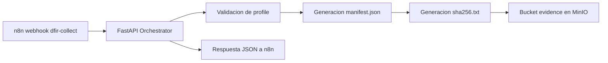

# 🧠 Fase 5 · Orchestrator API

> [!CAUTION]
> Este componente estuvo afectado por el incidente **P0-3** (credenciales por
> defecto de MinIO en repositorio público, en uso real por ausencia de `.env`).
> Antes de desplegar, leer **[`fase5-velociraptor/SECURITY-NOTICE.md`](../fase5-velociraptor/SECURITY-NOTICE.md)**.
> Las credenciales de MinIO se toman ahora de `.env` (ver `.env.example`); el
> orchestrator usa el usuario dedicado `tfm-orchestrator`, no las credenciales root.

> Microservicio **FastAPI** que valida solicitudes de colección forense, selecciona perfiles permitidos y registra la evidencia en **MinIO**.

> [!NOTE]
> **🎯 Objetivo del componente**  
> Actuar como capa de orquestacion entre n8n (u otros consumidores), la logica de perfiles de coleccion y el almacenamiento de evidencia en MinIO, generando `manifest.json` y `sha256.txt` con trazabilidad completa.

> [!TIP]
> Este servicio NO ejecuta colecciones reales contra Velociraptor Server, pero implementa el **pipeline de control y evidencia** previsto en la Fase 5 del TFM.

> [!IMPORTANT]
> **Corrección (Fase 5_4b, commit `456fbf9`, y Etapa D, 2026-09-18).** El
> aviso de arriba describe el estado de la primera validación de esta fase
> (2026-06-25) y ya no es cierto. Desde `456fbf9` este servicio **sí ejecuta
> colecciones reales** contra Velociraptor Server por gRPC, con hash real
> del ZIP subido a MinIO. Desde la Etapa D, la evidencia se enlaza además
> automáticamente al caso DFIR-IRIS. Ver la sección de cierre más abajo y
> `docs/REGISTRO-MEDICIONES-n8n-iris-2026-09-13.md` (sección 9, M-16 a M-20;
> sección 11, M-26 a M-31).

---

## 📋 Estado

- [x] 🐳 FastAPI operativo en Docker
- [x] 🔌 Endpoint `POST /velociraptor/collect` funcional
- [x] 🛡️ Validacion de perfiles mediante allowlist
- [x] 🔗 Integracion con MinIO para almacenamiento de evidencia
- [x] 📄 Generacion de `manifest.json` con metadatos estructurados
- [x] 🔐 Generacion de `sha256.txt` para integridad
- [x] 🗂️ Escritura en bucket `evidence` con estructura por incidente/host/timestamp
- [x] ✅ ZIP real de coleccion desde Velociraptor — cerrado en Fase 5_4b (commit `456fbf9`)
- [x] ✅ Integracion automatica con DFIR-IRIS — cerrado en la Etapa D (2026-09-18), caso IRIS #62

---

## 🎯 Objetivo

Este componente actua como **capa de orquestacion** entre n8n (u otros consumidores), la logica de perfiles de coleccion y el almacenamiento de evidencia en MinIO. Su responsabilidad principal es recibir una solicitud de coleccion, validar que el perfil este permitido, construir el manifiesto de evidencia y dejar trazabilidad estructurada para la Fase 5.

---

## 🏗️ Rol en la arquitectura



El servicio implementa el **pipeline de control y evidencia** previsto en la fase, recibiendo la orden de coleccion, validando el perfil, generando los metadatos y persistiendolos en MinIO.

---

## 📁 Estructura del repositorio

```text
fase5-orchestrator-api/
├── main.py
├── requirements.txt
├── Dockerfile
├── docker-compose.yml
└── README.md
```

---

## 🔌 Endpoint principal

### `POST /velociraptor/collect`

Recibe una peticion de coleccion forense, valida el perfil y genera la estructura de evidencia.

#### Payload esperado

```json
{
  "incidentid": "INC-2026-042",
  "host": "HOST-DC01",
  "profile": "credential_dump_collection",
  "source": "n8n-fase5"
}
```

#### Campos

| Campo | Tipo | Obligatorio | Descripcion |
|---|---|---|---|
| `incidentid` | string | ✅ | Identificador del incidente |
| `host` | string | ✅ | Host objetivo |
| `profile` | string | ✅ | Perfil de coleccion permitido |
| `source` | string | ❌ | Origen del evento |

---

## 🧾 Modelo de datos

### Manifest (manifest.json)

```json
{
  "incident_id": "INC-2026-042",
  "host": "HOST-DC01",
  "collection_profile": "credential_dump_collection",
  "selected_by": "forensics_agent_v1",
  "started_at": "20260625T185518Z",
  "ended_at": "20260625T185518Z",
  "artifact_list": [
    "Windows.System.Pslist",
    "Windows.Memory.Acquisition"
  ],
  "zip_path": "s3://evidence/INC-2026-042/HOST-DC01/20260625T185518Z/velociraptor_collection.zip",
  "zip_sha256": "2fc7f85ceed2e4a1bc5081a1691d231961b1ba093a7ef8671f4da34f601080f9",
  "operator": "orchestrator_v1",
  "source": "n8n-fase5"
}
```

### Hash (sha256.txt)

```text
2fc7f85ceed2e4a1bc5081a1691d231961b1ba093a7ef8671f4da34f601080f9  velociraptor_collection.zip
```

> [!WARNING]
> El campo `zip_sha256` actualmente contiene un valor simulado en la respuesta de prueba, ya que el servicio todavia no genera el ZIP real de coleccion desde Velociraptor.

> [!IMPORTANT]
> **Corrección (Fase 5_4b, commit `456fbf9`).** Este manifiesto y su
> `sha256.txt` son el ejemplo de la primera validación (2026-06-25), con
> `started_at == ended_at` y `zip_sha256` calculado sobre
> `incident_id + host + timestamp`, no sobre ningún fichero — el defecto que
> describe la sección 9 (M-16, M-17) del registro de mediciones. Desde
> `456fbf9` el ZIP se descarga por gRPC del filestore de Velociraptor,
> `started_at`/`ended_at` reflejan la duración real, y `zip_sha256` es el
> hash del fichero efectivamente subido — verificado idéntico en el
> filestore, `manifest.json` y el objeto descargado de MinIO. Ejemplo real
> (Etapa D, caso IRIS #62): flow `F.DAMLV9PKLOBUU`, 127 filas, 29025 bytes,
> `zip_sha256`
> `04a4fe554a2b707c4ba9125c65571d8d6f12b2a5875fb684670a00942ad657dc`,
> coincidente en cuatro puntos independientes (IRIS, `sha256.txt`,
> `manifest.json` y el objeto descargado).

---

## 🛡️ Perfiles permitidos

Los perfiles se validan mediante **allowlist** para evitar ejecuciones arbitrarias, en linea con el enfoque de control estricto del proyecto.

| Profile | Artefactos asociados |
|---|---|
| `credential_dump_collection` | `Windows.System.Pslist`, `Windows.Memory.Acquisition` |
| `ransomware_triage` | `Windows.System.Pslist` |
| `lateral_movement_probe` | `Windows.Network.Netstat`, `Windows.System.Pslist` |
| `generic_high_signal_collection` | `Windows.System.Pslist` |

Si el perfil no esta permitido, el servicio devuelve `400 - Profile not allowed`.

---

## 🐳 Despliegue Docker

### docker-compose.yml

```yaml
services:
  orchestrator:
    build: .
    container_name: orchestrator
    restart: unless-stopped
    ports:
      - "8020:8000"
    networks:
      - oob-network
      - single-node_default

    env_file:
      - .env

    environment:
      MINIO_ENDPOINT: minio:9000
      MINIO_BUCKET: evidence
      MINIO_SECURE: "false"
      PYTHONUNBUFFERED: "1"

      # --- Fase 7: Observabilidad / Métricas ---
      OS_URL: https://single-node-wazuh.indexer-1:9200
      OS_USER: admin
      OS_PASS: ${OS_PASS}
      OS_INDEX: tfm-metrics-events

    volumes:
      - ../fase7-observabilidad/shared:/app/shared:ro

networks:
  oob-network:
    external: true
  single-node_default:
    external: true
```

> [!IMPORTANT]
> Este servicio debe compartir la red Docker `oob-network` con n8n y MinIO para resolver correctamente los nombres internos de contenedor. La red `single-node_default` le da acceso al indexador de Wazuh para las métricas de la Fase 7.

> [!NOTE]
> `MINIO_ACCESS_KEY` y `MINIO_SECRET_KEY` **no** aparecen en el compose: se
> cargan desde `.env` (`env_file`). Ver `.env.example`. Corresponden al usuario
> `tfm-orchestrator`, no a las credenciales root de MinIO.
> `PYTHONUNBUFFERED: "1"` es necesario para que los avisos de `metrics_client`
> lleguen a los logs sin quedar retenidos en el buffer de stdout.
> El volumen de la Fase 7 se monta en `:ro`.

---

## 🌐 Redes y puertos

| Elemento | Valor |
|---|---|
| **Contenedor** | `orchestrator` |
| **Imagen** | `fase5-orchestrator-api-orchestrator` |
| **Puerto interno** | `8000/tcp` |
| **Puerto publicado** | `8020:8000/tcp` |
| **Red principal** | `oob-network` |
| **Red adicional** | `single-node_default` |
| **Endpoint principal** | `POST /velociraptor/collect` |
| **Servicio relacionado** | `minio:9000` |
| **Bucket** | `evidence` |

---

## 🔐 Variables de entorno

| Variable | Origen | Descripcion |
|---|---|---|
| `MINIO_ENDPOINT` | compose | Endpoint interno del servicio MinIO (`minio:9000`) |
| `MINIO_ACCESS_KEY` | `.env` (sin valor por defecto) | Access key del usuario `tfm-orchestrator`. Ver `.env.example`. |
| `MINIO_SECRET_KEY` | `.env` (sin valor por defecto) | Secret key del usuario `tfm-orchestrator`. Ver `.env.example`. |
| `MINIO_BUCKET` | compose | Bucket de evidencia (`evidence`) |
| `MINIO_SECURE` | compose | Uso de HTTP/HTTPS hacia MinIO (`false`) |
| `OS_PASS` | `.env` (sin valor por defecto) | Contraseña del indexador de Wazuh (métricas Fase 7). Ver `.env.example`. |

> [!IMPORTANT]
> `MINIO_ACCESS_KEY`, `MINIO_SECRET_KEY` y `OS_PASS` se documentan **sin valor**:
> se definen en `.env` (excluido por `.gitignore`), nunca en el repositorio. La
> versión anterior no traía `.env`, de modo que docker-compose aplicaba el
> valor por defecto definido en el propio compose y la credencial documentada
> era la credencial en uso (P0-3).
>
> El orchestrator se autentica ahora con el usuario dedicado `tfm-orchestrator`
> y la política `evidence-writer`, limitada a `evidence/*` y **sin
> `s3:DeleteObject`**: puede escribir y leer evidencia, no borrarla. No usa las
> credenciales root de MinIO.

---

## 🔁 Flujo de procesamiento

1. n8n (u otro consumidor) envia una solicitud HTTP al endpoint `/velociraptor/collect`.
2. FastAPI valida el `profile` contra la allowlist.
3. Se genera un timestamp UTC.
4. Se construye el objeto `manifest` con los metadatos de la coleccion.
5. Se calcula el valor `zip_sha256` (actualmente simulado en pruebas).
6. Se generan los archivos `manifest.json` y `sha256.txt`.
7. Ambos se almacenan en el bucket `evidence` en MinIO.
8. El servicio devuelve una respuesta JSON con estado `queued` y la ubicacion logica de la evidencia.

---

## 🗂️ Estructura de evidencias en MinIO

```text
evidence/
└── INC-2026-042/
    └── HOST-DC01/
        └── 20260625T185518Z/
            ├── manifest.json
            └── sha256.txt
```

Esto deja preparada la base para el siguiente paso del proyecto: añadir el ZIP real de coleccion y registrar la evidencia automaticamente en DFIR-IRIS.

> **Cierre.** Ambos pasos están hechos — ver la sección de cierre al final
> de este documento.

---

## 🧪 Validacion funcional

### Lanzar coleccion

```bash
curl -X POST http://localhost:8020/velociraptor/collect \
  -H "Content-Type: application/json" \
  -d '{
    "incidentid": "INC-2026-042",
    "host": "HOST-DC01",
    "profile": "credential_dump_collection",
    "source": "n8n-fase5"
  }'
```

### Verificar evidencias en MinIO

```bash
mc ls minio/evidence/INC-2026-042/HOST-DC01/
```

### Resultado esperado

- `manifest.json` con metadatos completos
- `sha256.txt` con hash del ZIP
- Estructura de directorios por incidente/host/timestamp

---

## ⚠️ Consideraciones de seguridad

- 🔐 **MinIO:** credenciales del usuario dedicado `tfm-orchestrator` cargadas desde `.env` (nunca en el repositorio). Política `evidence-writer`: acceso limitado a `evidence/*`, **sin `s3:DeleteObject`**.
- 🔒 **SHA-256:** hash de cada ZIP para integridad de la evidencia
- 📝 **Manifest:** metadatos completos de cada coleccion para trazabilidad
- 🗂️ **Evidence Store:** estructura clara por incidente/host/timestamp
- 🛡️ **Allowlist:** validacion estricta de perfiles para evitar ejecuciones arbitrarias

> [!WARNING]
> **Riesgos residuales conocidos tras el P0-3** (ver `fase5-velociraptor/SECURITY-NOTICE.md`):
> - Quitar `s3:DeleteObject` impide el borrado pero **no la sobrescritura**: una clave existente puede reemplazarse sin dejar rastro. Hace falta versionado o bloqueo de objetos en el bucket.
> - ~~`incidentid` y `host` llegan sin validar en el payload y se usan para construir la clave del objeto: es posible escribir en rutas arbitrarias del bucket.~~ **Corrección (2026-09-21):** cerrado desde el commit `36d40b2` (2026-09-03, P0-4). `CollectRequest` en `main.py:134-135` valida ambos campos con `Field(pattern=r"^[A-Za-z0-9._-]{1,64}$")`, documentado en `docs/INFORME-P0-4-implementacion.md`. Este párrafo describía un riesgo ya cerrado en el momento en que se redactó esta sección; se conserva tachado para dejar constancia.
> - MinIO publica su API (`0.0.0.0:9000`) y su consola (`0.0.0.0:9001`) sin TLS.

---

## 🚧 Limitaciones conocidas

| Limitacion | Impacto | Estado |
|---|---|---|
| ZIP real de coleccion | El servicio no genera el ZIP real desde Velociraptor | ✅ Cerrado (Fase 5_4b, `456fbf9`) |
| Hash real del ZIP | El campo `zip_sha256` contiene valor simulado | ✅ Cerrado (Fase 5_4b, `456fbf9`) |
| Integracion con DFIR-IRIS | No se registra la evidencia automaticamente en IRIS | ✅ Cerrado (Etapa D, caso IRIS #62) |
| Bucket sin versionado | Quitar `s3:DeleteObject` no impide la sobrescritura de un manifiesto | 🔴 Pendiente (P0-3) |
| `incidentid` / `host` sin validar | Se usan sin sanear para construir la clave del objeto en MinIO | ✅ Cerrado (P0-4, commit `36d40b2`, 2026-09-03) — corrección 2026-09-21, esta fila decía `🔴 Pendiente` |

---

## 🚀 Prximos pasos

1. ~~🟡 Añadir generacion real del ZIP de coleccion desde Velociraptor Server~~ — ✅ cerrado en Fase 5_4b (`456fbf9`)
2. ~~🟡 Calcular hash SHA-256 real del ZIP generado~~ — ✅ cerrado en Fase 5_4b (`456fbf9`)
3. ~~🟡 Integrar con DFIR-IRIS para registro automatico de evidencias (Fase 6)~~ — ✅ cerrado en la Etapa D (2026-09-18), caso IRIS #62
4. 🔴 Activar versionado / bloqueo de objetos en el bucket `evidence` (P0-3)
5. ~~🔴 Validar `incidentid` y `host` antes de construir la clave del objeto (P0-3)~~ — ✅ cerrado en P0-4 (commit `36d40b2`, 2026-09-03); corrección 2026-09-21
6. 🟡 Añadir validacion de integridad de evidencias (verificar hash)

---

## 🧠 Resultado

Este componente ya cumple el papel de **orquestador tcnico de evidencia** dentro de la Fase 5: recibe la orden, valida el perfil, construye metadatos trazables y los persiste en MinIO, dejando el sistema preparado para una futura integracion completa con Velociraptor Server y DFIR-IRIS.

---

## 📊 Estado actual

| Elemento | Estado |
|---|---|
| FastAPI operativo | ✅ |
| Endpoint `/velociraptor/collect` | ✅ |
| Validacion de perfiles | ✅ |
| Integracion con MinIO | ✅ |
| Generacion de `manifest.json` | ✅ |
| Generacion de `sha256.txt` | ✅ |
| Escritura en bucket `evidence` | ✅ |
| ZIP real de Velociraptor | ✅ Cerrado (Fase 5_4b, `456fbf9`) |
| Integracion automatica con DFIR-IRIS | ✅ Cerrado (Etapa D, caso IRIS #62) |

---

## ✅ Cierre — recolección real y enlace a IRIS

Este documento describe, en varias secciones, el estado de la primera
validación de la Fase 5 (2026-06-25): ZIP simulado, `zip_sha256` calculado
sobre identificadores en vez de sobre un fichero, `started_at == ended_at`,
y sin integración con DFIR-IRIS. Se conserva tal cual se redactó porque
documenta la evolución del proyecto, no el comportamiento actual — los
avisos y tablas de arriba llevan ahora una corrección puntual señalando
dónde dejaron de ser ciertos.

**Fase 5_4b (2026-09-17, commit `456fbf9`)** sustituyó la simulación por una
recolección real vía gRPC contra Velociraptor: el ZIP se descarga del
filestore, `started_at`/`ended_at` reflejan la duración real de la
colección, y `zip_sha256` es el hash del fichero efectivamente subido a
MinIO — verificado idéntico en el filestore de Velociraptor, `manifest.json`
y el objeto descargado de MinIO.

**Etapa D (2026-09-18)** añadió el enlace automático al caso IRIS mediante
`POST /case/evidences/add`, sin nota manual ni intervención humana. Prueba
de extremo a extremo, caso IRIS **#62**: alerta real → triaje CRITICA →
caso → War Room → recolección por gRPC → ZIP en
`s3://evidence/INC-62/DC01-TFM/20260918T155828Z/velociraptor_collection.zip`
→ evidencia enlazada al caso. El sha256
`04a4fe554a2b707c4ba9125c65571d8d6f12b2a5875fb684670a00942ad657dc` coincide
en cuatro puntos independientes: el registro de evidencia de IRIS, el
`sha256.txt` del bucket, el `manifest.json` y el recálculo sobre los bytes
del objeto descargado de MinIO. Detalle medido en
`docs/REGISTRO-MEDICIONES-n8n-iris-2026-09-13.md`, sección 9 (M-16 a M-20)
y sección 11 (M-26 a M-31).

Las dos filas de "Bucket sin versionado" e "`incidentid`/`host` sin validar"
de la tabla de limitaciones conocidas (P0-3) **no están cerradas** por esta
sesión y siguen `🔴 Pendiente`.

> **Corrección (2026-09-21).** El párrafo anterior es correcto respecto a lo
> que cerró *esta* sesión (Etapa D, 2026-09-18), pero ha quedado incompleto:
> la fila `incidentid`/`host` sin validar se cerró por una sesión distinta y
> anterior, la del P0-4 (commit `36d40b2`, 2026-09-03), que añadió
> `Field(pattern=r"^[A-Za-z0-9._-]{1,64}$")` a ambos campos en
> `fase5-orchestrator-api/main.py:134-135` (`docs/INFORME-P0-4-implementacion.md`).
> Solo "Bucket sin versionado" sigue `🔴 Pendiente` hoy. Ver la tabla de
> "Limitaciones conocidas" más arriba, ya corregida.

Pendiente todavía, sin medir: la prueba negativa de `Comparar Hash` (forzar
un nombre de campo erróneo en `Preparar Evidencia` y comprobar que el aviso
sale como fallo) — el nodo está ejercitado solo en el camino correcto.

> **Corrección (2026-09-21).** El párrafo anterior ya no es exacto.
> `docs/REGISTRO-MEDICIONES-n8n-iris-2026-09-13.md` documenta esa prueba
> negativa exacta, ejecutada el 2026-09-18: el caso **#77**, con el hash
> enviado como `file_sha256` en vez de `file_hash` en `Preparar Evidencia`,
> produjo el aviso de fallo esperado — "ninguna de las 1 evidencias del caso
> casa con el hash del manifiesto. Presentes: (sin hash)" — frente al caso
> **#76**, con el campo correcto, que produjo "✅ Hash verificado contra el
> registro de IRIS" (M-38: dos entradas distintas, dos salidas distintas).
> Además, la misma sesión (M-39) corrigió que el nodo `Comparar Hash` **no
> tenía conexión de salida** — calculaba el veredicto pero no llegaba a
> ningún canal —, conectándolo para que publique en el War Room del
> incidente concreto. Con las dos correcciones, la cadena queda verificada
> de extremo a extremo: compara, distingue entrada válida de inválida, y
> entrega el resultado donde corresponde.

---

**Repositorio:** `fase5-orchestrator-api`  
**Fase del TFM:** Fase 5 - Forensics Automatizado  
**Proyecto:** `tfm-alerta-temprana-oob`