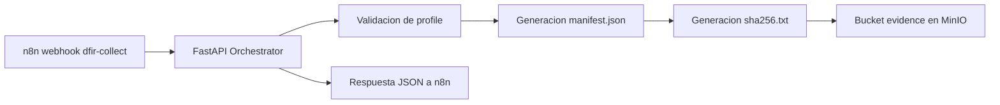

# 🧠 Fase 5 · Orchestrator API

> Microservicio **FastAPI** que valida solicitudes de colección forense, selecciona perfiles permitidos y registra la evidencia en **MinIO**.

> [!NOTE]
> **🎯 Objetivo del componente**  
> Actuar como capa de orquestacion entre n8n (u otros consumidores), la logica de perfiles de coleccion y el almacenamiento de evidencia en MinIO, generando `manifest.json` y `sha256.txt` con trazabilidad completa.

> [!TIP]
> Este servicio NO ejecuta colecciones reales contra Velociraptor Server, pero implementa el **pipeline de control y evidencia** previsto en la Fase 5 del TFM.

---

## 📋 Estado

- [x] 🐳 FastAPI operativo en Docker
- [x] 🔌 Endpoint `POST /velociraptor/collect` funcional
- [x] 🛡️ Validacion de perfiles mediante allowlist
- [x] 🔗 Integracion con MinIO para almacenamiento de evidencia
- [x] 📄 Generacion de `manifest.json` con metadatos estructurados
- [x] 🔐 Generacion de `sha256.txt` para integridad
- [x] 🗂️ Escritura en bucket `evidence` con estructura por incidente/host/timestamp
- [ ] 🟡 ZIP real de coleccion desde Velociraptor (pendiente)
- [ ] 🟡 Integracion automatica con DFIR-IRIS (pendiente)

---

## 🎯 Objetivo

Este componente actua como **capa de orquestacion** entre n8n (u otros consumidores), la logica de perfiles de coleccion y el almacenamiento de evidencia en MinIO. Su responsabilidad principal es recibir una solicitud de coleccion, validar que el perfil este permitido, construir el manifiesto de evidencia y dejar trazabilidad estructurada para la Fase 5.

---

## 🏗️ Rol en la arquitectura



El servicio implementa el **pipeline de control y evidencia** previsto en la fase, recibiendo la orden de coleccion, validando el perfil, generando los metadatos y persistiendolos en MinIO.

---

## 📁 Estructura del repositorio

```text
fase5-orchestrator-api/
├── main.py
├── requirements.txt
├── Dockerfile
├── docker-compose.yml
└── README.md
```

---

## 🔌 Endpoint principal

### `POST /velociraptor/collect`

Recibe una peticion de coleccion forense, valida el perfil y genera la estructura de evidencia.

#### Payload esperado

```json
{
  "incidentid": "INC-2026-042",
  "host": "HOST-DC01",
  "profile": "credential_dump_collection",
  "source": "n8n-fase5"
}
```

#### Campos

| Campo | Tipo | Obligatorio | Descripcion |
|---|---|---|---|
| `incidentid` | string | ✅ | Identificador del incidente |
| `host` | string | ✅ | Host objetivo |
| `profile` | string | ✅ | Perfil de coleccion permitido |
| `source` | string | ❌ | Origen del evento |

---

## 🧾 Modelo de datos

### Manifest (manifest.json)

```json
{
  "incident_id": "INC-2026-042",
  "host": "HOST-DC01",
  "collection_profile": "credential_dump_collection",
  "selected_by": "forensics_agent_v1",
  "started_at": "20260625T185518Z",
  "ended_at": "20260625T185518Z",
  "artifact_list": [
    "Windows.System.Pslist",
    "Windows.Memory.Acquisition"
  ],
  "zip_path": "s3://evidence/INC-2026-042/HOST-DC01/20260625T185518Z/velociraptor_collection.zip",
  "zip_sha256": "2fc7f85ceed2e4a1bc5081a1691d231961b1ba093a7ef8671f4da34f601080f9",
  "operator": "orchestrator_v1",
  "source": "n8n-fase5"
}
```

### Hash (sha256.txt)

```text
2fc7f85ceed2e4a1bc5081a1691d231961b1ba093a7ef8671f4da34f601080f9  velociraptor_collection.zip
```

> [!WARNING]
> El campo `zip_sha256` actualmente contiene un valor simulado en la respuesta de prueba, ya que el servicio todavia no genera el ZIP real de coleccion desde Velociraptor.

---

## 🛡️ Perfiles permitidos

Los perfiles se validan mediante **allowlist** para evitar ejecuciones arbitrarias, en linea con el enfoque de control estricto del proyecto.

| Profile | Artefactos asociados |
|---|---|
| `credential_dump_collection` | `Windows.System.Pslist`, `Windows.Memory.Acquisition` |
| `ransomware_triage` | `Windows.System.Pslist` |
| `lateral_movement_probe` | `Windows.Network.Netstat`, `Windows.System.Pslist` |
| `generic_high_signal_collection` | `Windows.System.Pslist` |

Si el perfil no esta permitido, el servicio devuelve `400 - Profile not allowed`.

---

## 🐳 Despliegue Docker

### docker-compose.yml

```yaml
services:
  orchestrator:
    build: .
    container_name: orchestrator
    restart: unless-stopped
    ports:
      - "8020:8000"
    environment:
      MINIO_ENDPOINT: minio:9000
      MINIO_ACCESS_KEY: minioadmin
      MINIO_SECRET_KEY: minioadmin123
      MINIO_BUCKET: evidence
      MINIO_SECURE: "false"
    networks:
      - oob-network

networks:
  oob-network:
    external: true
```

> [!IMPORTANT]
> Este servicio debe compartir la red Docker `oob-network` con n8n y MinIO para resolver correctamente los nombres internos de contenedor.

---

## 🌐 Redes y puertos

| Elemento | Valor |
|---|---|
| **Contenedor** | `orchestrator` |
| **Imagen** | `fase5-orchestrator-api-orchestrator` |
| **Puerto interno** | `8000/tcp` |
| **Puerto publicado** | `8020:8000/tcp` |
| **Red principal** | `oob-network` |
| **Red adicional** | `single-node_default` |
| **Estado observado** | `Up 23 hours` |
| **Endpoint principal** | `POST /velociraptor/collect` |
| **Servicio relacionado** | `minio:9000` |
| **Bucket** | `evidence` |

---

## 🔐 Variables de entorno

| Variable | Ejemplo | Descripcion |
|---|---|---|
| `MINIO_ENDPOINT` | `minio:9000` | Endpoint interno del servicio MinIO |
| `MINIO_ACCESS_KEY` | `minioadmin` | Usuario de acceso (⚠️ cambiar en produccion) |
| `MINIO_SECRET_KEY` | `minioadmin123` | Contrasena de acceso (⚠️ cambiar en produccion) |
| `MINIO_BUCKET` | `evidence` | Bucket de evidencia |
| `MINIO_SECURE` | `false` | Uso de HTTP/HTTPS hacia MinIO |

> [!WARNING]
> Las credenciales `minioadmin` / `minioadmin123` son valores de laboratorio. En un entorno de produccion deben sustituirse por credenciales seguras y gestionarse mediante secretos.

---

## 🔁 Flujo de procesamiento

1. n8n (u otro consumidor) envia una solicitud HTTP al endpoint `/velociraptor/collect`.
2. FastAPI valida el `profile` contra la allowlist.
3. Se genera un timestamp UTC.
4. Se construye el objeto `manifest` con los metadatos de la coleccion.
5. Se calcula el valor `zip_sha256` (actualmente simulado en pruebas).
6. Se generan los archivos `manifest.json` y `sha256.txt`.
7. Ambos se almacenan en el bucket `evidence` en MinIO.
8. El servicio devuelve una respuesta JSON con estado `queued` y la ubicacion logica de la evidencia.

---

## 🗂️ Estructura de evidencias en MinIO

```text
evidence/
└── INC-2026-042/
    └── HOST-DC01/
        └── 20260625T185518Z/
            ├── manifest.json
            └── sha256.txt
```

Esto deja preparada la base para el siguiente paso del proyecto: añadir el ZIP real de coleccion y registrar la evidencia automaticamente en DFIR-IRIS.

---

## 🧪 Validacion funcional

### Lanzar coleccion

```bash
curl -X POST http://localhost:8020/velociraptor/collect \
  -H "Content-Type: application/json" \
  -d '{
    "incidentid": "INC-2026-042",
    "host": "HOST-DC01",
    "profile": "credential_dump_collection",
    "source": "n8n-fase5"
  }'
```

### Verificar evidencias en MinIO

```bash
mc ls minio/evidence/INC-2026-042/HOST-DC01/
```

### Resultado esperado

- `manifest.json` con metadatos completos
- `sha256.txt` con hash del ZIP
- Estructura de directorios por incidente/host/timestamp

---

## ⚠️ Consideraciones de seguridad

- 🔐 **MinIO:** acceso con credenciales en variables de entorno (⚠️ cambiar en produccion)
- 🔒 **SHA-256:** hash de cada ZIP para integridad de la evidencia
- 📝 **Manifest:** metadatos completos de cada coleccion para trazabilidad
- 🗂️ **Evidence Store:** estructura clara por incidente/host/timestamp
- 🛡️ **Allowlist:** validacion estricta de perfiles para evitar ejecuciones arbitrarias

---

## 🚧 Limitaciones conocidas

| Limitacion | Impacto | Estado |
|---|---|---|
| ZIP real de coleccion | El servicio no genera el ZIP real desde Velociraptor | 🟡 Pendiente |
| Hash real del ZIP | El campo `zip_sha256` contiene valor simulado | 🟡 Pendiente |
| Integracion con DFIR-IRIS | No se registra la evidencia automaticamente en IRIS | 🟡 Pendiente |
| Credenciales de ejemplo | Las credenciales de MinIO son de laboratorio | ⚠️ Cambiar en produccion |

---

## 🚀 Prximos pasos

1. 🟡 Añadir generacion real del ZIP de coleccion desde Velociraptor Server
2. 🟡 Calcular hash SHA-256 real del ZIP generado
3. 🟡 Integrar con DFIR-IRIS para registro automatico de evidencias (Fase 6)
4. 🟡 Sustituir credenciales de ejemplo por secretos de produccion
5. 🟡 Añadir validacion de integridad de evidencias (verificar hash)

---

## 🧠 Resultado

Este componente ya cumple el papel de **orquestador tcnico de evidencia** dentro de la Fase 5: recibe la orden, valida el perfil, construye metadatos trazables y los persiste en MinIO, dejando el sistema preparado para una futura integracion completa con Velociraptor Server y DFIR-IRIS.

---

## 📊 Estado actual

| Elemento | Estado |
|---|---|
| FastAPI operativo | ✅ |
| Endpoint `/velociraptor/collect` | ✅ |
| Validacion de perfiles | ✅ |
| Integracion con MinIO | ✅ |
| Generacion de `manifest.json` | ✅ |
| Generacion de `sha256.txt` | ✅ |
| Escritura en bucket `evidence` | ✅ |
| ZIP real de Velociraptor | 🟡 Pendiente |
| Integracion automatica con DFIR-IRIS | 🟡 Pendiente |

---

**Repositorio:** `fase5-orchestrator-api`  
**Fase del TFM:** Fase 5 - Forensics Automatizado  
**Proyecto:** `tfm-alerta-temprana-oob`