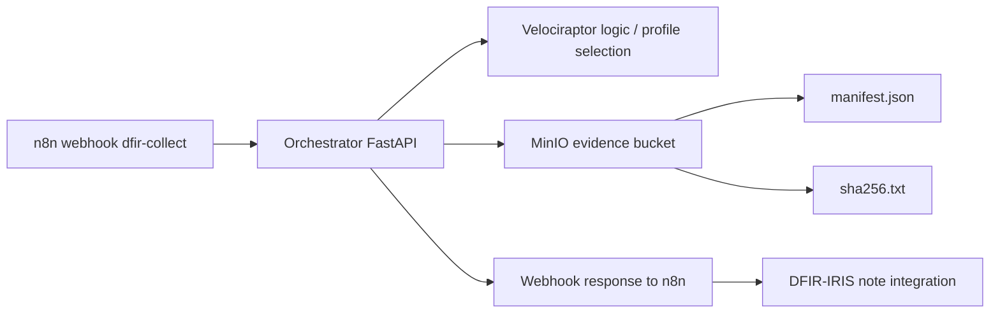

# 🦖 Fase 5 — Forensics Automático (Velociraptor + MinIO)

> **Aviso de seguridad.** El material criptográfico del servidor Velociraptor
> estuvo versionado en este repositorio. Antes de trabajar con esta fase, lee
> [`SECURITY-NOTICE.md`](SECURITY-NOTICE.md): el estado de runtime ya no se
> versiona y las configuraciones reales se reconstruyen desde
> `config-templates/` (ver "Reconstrucción de la configuración" más abajo).

> **Objetivo de la fase:** implementar una captura forense automática vinculada al flujo de triage del proyecto **alerta-temprana-oob**, almacenando evidencias en MinIO con trazabilidad mediante `manifest.json` y `sha256.txt`, como base para su posterior registro en DFIR-IRIS.

---

## 📌 Índice

- [1. Objetivo de la fase](#-1-objetivo-de-la-fase)
- [2. Arquitectura implementada](#-2-arquitectura-implementada)
- [3. Componentes desplegados](#-3-componentes-desplegados)
- [4. Flujo funcional validado](#-4-flujo-funcional-validado)
- [5. Evidencia generada](#-5-evidencia-generada)
- [6. Validación real realizada](#-6-validación-real-realizada)
- [7. Nota preparada para DFIR-IRIS](#-7-nota-preparada-para-dfir-iris)
- [8. Estado de la fase](#-8-estado-de-la-fase)

---

## 🎯 1. Objetivo de la fase

Esta fase tiene como finalidad automatizar la **colección forense inicial** para incidentes HIGH/CRITICAL mediante Velociraptor, sin depender de intervención manual en el endpoint, y almacenar la evidencia en un repositorio S3-compatible gestionado por MinIO.

El resultado esperado en la propuesta es un pipeline del tipo:

```text
Velociraptor collection → ZIP → MinIO → manifest.json + sha256 → nota en IRIS
```

Tal como se define en la memoria del TFM, la estructura de evidencia debe quedar organizada por `incident_id`, `host` y `timestamp`.

---

## 🏗️ 2. Arquitectura implementada



La implementación realizada en esta fase deja operativo el tramo **n8n → Orchestrator → MinIO**, con escritura efectiva de evidencia en el bucket `evidence`.

---

## 🧩 3. Componentes desplegados

| Componente | Estado | Resultado |
|---|---|---|
| 🦖 Orchestrator FastAPI | ✅ Operativo | Endpoint `/velociraptor/collect` funcional |
| 🔗 n8n webhook `dfir-collect` | ✅ Operativo | Payload correcto entre nodos |
| 📦 Perfil `credential_dump_collection` | ✅ Validado | Perfil permitido y ejecutado |
| 🗄️ MinIO bucket `evidence` | ✅ Operativo | Escritura validada |
| 🧾 `manifest.json` | ✅ Generado | Persistido en MinIO |
| 🔐 `sha256.txt` | ✅ Generado | Persistido en MinIO |
| 🗂️ Nota DFIR-IRIS | 🟡 Preparada | Pendiente de automatización |

---

## 🔁 4. Flujo funcional validado

El flujo probado en esta fase ha sido el siguiente:

1. Un `curl` envía un evento al webhook de n8n en modo test.
2. n8n normaliza el payload y lo reenvía al endpoint interno del orquestador.
3. El orquestador valida el perfil solicitado y construye el manifiesto de evidencia.
4. El orquestador genera `manifest.json` y `sha256.txt`.
5. Ambos artefactos se almacenan en MinIO dentro del bucket `evidence`.
6. n8n devuelve una respuesta final con estado `queued` y datos del manifiesto.

---

## 🗂️ 5. Evidencia generada

La estructura prevista para la evidencia en MinIO, definida en la propuesta del TFM, es la siguiente:

```text
/evidence/
  {incident_id}/
    {host}/
      {timestamp}/
        velociraptor_collection.zip
        manifest.json
        sha256.txt
```

En la validación real realizada durante esta fase, se confirmó la creación de la siguiente ruta en MinIO:

```text
evidence/INC-2026-042/HOST-DC01/20260625T185518Z/
```

Con los siguientes artefactos presentes:

- `manifest.json`
- `sha256.txt`

---

## ✅ 6. Validación real realizada

Se ejecutó una prueba completa sobre el incidente `INC-2026-042` y el host `HOST-DC01`, utilizando el perfil `credential_dump_collection`, con resultado satisfactorio.

### `manifest.json` validado

```json
{
  "incident_id": "INC-2026-042",
  "host": "HOST-DC01",
  "collection_profile": "credential_dump_collection",
  "selected_by": "forensics_agent_v1",
  "started_at": "20260625T185518Z",
  "ended_at": "20260625T185518Z",
  "artifact_list": [
    "Windows.System.Pslist",
    "Windows.Memory.Acquisition"
  ],
  "zip_path": "s3://evidence/INC-2026-042/HOST-DC01/20260625T185518Z/velociraptor_collection.zip",
  "zip_sha256": "2fc7f85ceed2e4a1bc5081a1691d231961b1ba093a7ef8671f4da34f601080f9",
  "operator": "orchestrator_v1",
  "source": "n8n-fase5"
}
```

### Resumen de validación

| Campo | Valor |
|---|---|
| Incident ID | `INC-2026-042` |
| Host | `HOST-DC01` |
| Profile | `credential_dump_collection` |
| Artifacts | `Windows.System.Pslist`, `Windows.Memory.Acquisition` |
| MinIO path | `evidence/INC-2026-042/HOST-DC01/20260625T185518Z/` |
| SHA-256 | `2fc7f85ceed2e4a1bc5081a1691d231961b1ba093a7ef8671f4da34f601080f9` |
| Result | `OK` |

---

## 📝 7. Nota preparada para DFIR-IRIS

Como siguiente paso de integración, se ha definido una nota textual compatible con el caso DFIR-IRIS, siguiendo el requisito de trazabilidad completa indicado en la propuesta.

```text
[Forensics Evidence Added]

Velociraptor collection executed successfully.

Incident ID: INC-2026-042
Host: HOST-DC01
Collection profile: credential_dump_collection
Selected by: forensics_agent_v1
Started at: 20260625T185518Z
Ended at: 20260625T185518Z

Artifacts collected:
- Windows.System.Pslist
- Windows.Memory.Acquisition

Evidence storage:
- ZIP path: s3://evidence/INC-2026-042/HOST-DC01/20260625T185518Z/velociraptor_collection.zip
- SHA-256: 2fc7f85ceed2e4a1bc5081a1691d231961b1ba093a7ef8671f4da34f601080f9

Recorded by: orchestrator_v1
Source: n8n-fase5
```

Esta nota todavía no se inserta automáticamente en IRIS, pero ya está preparada para su uso manual o para una futura integración por API desde n8n o desde el orquestador.

---

## 📊 8. Estado de la fase

| Subobjetivo | Estado |
|---|---|
| Despliegue de Velociraptor server | 🟡 Parcial / lógico |
| Integración webhook n8n → Orchestrator | ✅ Completado |
| Validación de perfiles permitidos | ✅ Completado |
| Generación de `manifest.json` | ✅ Completado |
| Generación de `sha256.txt` | ✅ Completado |
| Persistencia en MinIO | ✅ Completado |
| Evidencia trazable por incidente/host/timestamp | ✅ Completado |
| Registro automático en DFIR-IRIS | 🟡 Pendiente |
| Subida de `velociraptor_collection.zip` real | 🟡 Pendiente |

---

## Reconstrucción de la configuración

El estado de runtime del servidor (`velociraptor-config/`) y las
configuraciones reales (`server.config.yaml`, `client.config.yaml`,
`api_client.yaml`) **no se versionan**: contienen material criptográfico.
Ver `.gitignore` y `SECURITY-NOTICE.md`.

En el repositorio solo viven plantillas sanitizadas en `config-templates/`,
con el material criptográfico sustituido por `<<GENERADO_EN_DESPLIEGUE>>` y los
campos de topología (puertos, `bind_address`, `public_url`, rutas del
datastore) con su valor real.

### Regenerar `server.config.yaml`

```bash
docker run --rm velociraptor-oob:0.76.6 --nobanner config generate \
  > velociraptor-config/server.config.yaml
```

Después alinear a mano los campos de topología con
`config-templates/server.config.template.yaml` (todos los que no son el
marcador). El fichero resultante no se añade al control de versiones.

### Regenerar `client.config.yaml`

```bash
docker run --rm -v "$PWD/velociraptor-config:/velociraptor" \
  velociraptor-oob:0.76.6 --config /velociraptor/server.config.yaml \
  --nobanner config client > client.config.yaml
```

### Regenerar el MSI de cliente

El MSI lleva embebida la configuración de cliente (con su `ca_certificate` y su
`nonce`), por eso `installer-windows/` y `*.msi` están excluidos del
repositorio. Se reconstruye reempaquetando el MSI oficial de Velociraptor con
la configuración de cliente recién generada (`config repack --msi`; comprobar
la sintaxis exacta con `--help` de la versión en uso):

```bash
docker run --rm -v "$PWD:/work" -w /work \
  velociraptor-oob:0.76.6 --config velociraptor-config/server.config.yaml \
  --nobanner config repack --msi <velociraptor-oficial-windows-amd64.msi> \
  client.config.yaml installer-windows/velociraptor-client.msi
```

---

## 🧠 Resultado alcanzado

La Fase 5 queda validada funcionalmente en su núcleo: el sistema ya puede recibir una orden de colección, procesar el incidente, construir un manifiesto coherente y persistir evidencia estructurada en MinIO bajo control del enclave OOB.

Esto deja preparado el siguiente salto evolutivo del proyecto: **integrar automáticamente DFIR-IRIS** y, más adelante, sustituir el ZIP lógico por un artefacto real procedente de Velociraptor.