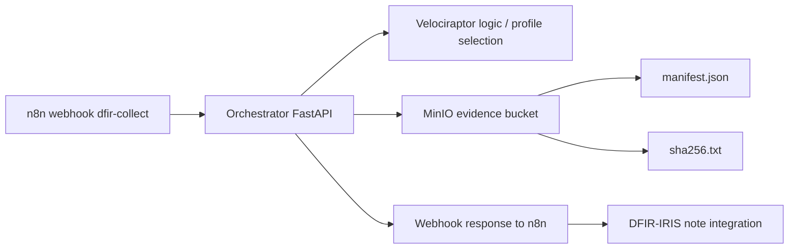

# 🦖 Fase 5 — Forensics Automático (Velociraptor + MinIO)

> **Aviso de seguridad.** El material criptográfico del servidor Velociraptor
> estuvo versionado en este repositorio. Antes de trabajar con esta fase, lee
> [`SECURITY-NOTICE.md`](SECURITY-NOTICE.md): el estado de runtime ya no se
> versiona y las configuraciones reales se reconstruyen desde
> `config-templates/` (ver "Reconstrucción de la configuración" más abajo).

> **Objetivo de la fase:** implementar una captura forense automática vinculada al flujo de triage del proyecto **alerta-temprana-oob**, almacenando evidencias en MinIO con trazabilidad mediante `manifest.json` y `sha256.txt`, como base para su posterior registro en DFIR-IRIS.

---

## 📌 Índice

- [1. Objetivo de la fase](#-1-objetivo-de-la-fase)
- [2. Arquitectura implementada](#-2-arquitectura-implementada)
- [3. Componentes desplegados](#-3-componentes-desplegados)
- [4. Flujo funcional validado](#-4-flujo-funcional-validado)
- [5. Evidencia generada](#-5-evidencia-generada)
- [6. Validación real realizada](#-6-validación-real-realizada)
- [7. Nota preparada para DFIR-IRIS](#-7-nota-preparada-para-dfir-iris)
- [8. Estado de la fase](#-8-estado-de-la-fase)

---

## 🎯 1. Objetivo de la fase

Esta fase tiene como finalidad automatizar la **colección forense inicial** para incidentes HIGH/CRITICAL mediante Velociraptor, sin depender de intervención manual en el endpoint, y almacenar la evidencia en un repositorio S3-compatible gestionado por MinIO.

El resultado esperado en la propuesta es un pipeline del tipo:

```text
Velociraptor collection → ZIP → MinIO → manifest.json + sha256 → nota en IRIS
```

Tal como se define en la memoria del TFM, la estructura de evidencia debe quedar organizada por `incident_id`, `host` y `timestamp`.

---

## 🏗️ 2. Arquitectura implementada



La implementación realizada en esta fase deja operativo el tramo **n8n → Orchestrator → MinIO**, con escritura efectiva de evidencia en el bucket `evidence`.

---

## 🧩 3. Componentes desplegados

| Componente | Estado | Resultado |
|---|---|---|
| 🦖 Orchestrator FastAPI | ✅ Operativo | Endpoint `/velociraptor/collect` funcional |
| 🔗 n8n webhook `dfir-collect` | ✅ Operativo | Payload correcto entre nodos |
| 📦 Perfil `credential_dump_collection` | ✅ Validado | Perfil permitido y ejecutado |
| 🗄️ MinIO bucket `evidence` | ✅ Operativo | Escritura validada |
| 🧾 `manifest.json` | ✅ Generado | Persistido en MinIO |
| 🔐 `sha256.txt` | ✅ Generado | Persistido en MinIO |
| 🗂️ Nota DFIR-IRIS | ✅ Automatizada | Cerrado en la Etapa D (2026-09-18) — ver sección de cierre más abajo |

---

## 🔁 4. Flujo funcional validado

El flujo probado en esta fase ha sido el siguiente:

1. Un `curl` envía un evento al webhook de n8n en modo test.
2. n8n normaliza el payload y lo reenvía al endpoint interno del orquestador.
3. El orquestador valida el perfil solicitado y construye el manifiesto de evidencia.
4. El orquestador genera `manifest.json` y `sha256.txt`.
5. Ambos artefactos se almacenan en MinIO dentro del bucket `evidence`.
6. n8n devuelve una respuesta final con estado `queued` y datos del manifiesto.

---

## 🗂️ 5. Evidencia generada

La estructura prevista para la evidencia en MinIO, definida en la propuesta del TFM, es la siguiente:

```text
/evidence/
  {incident_id}/
    {host}/
      {timestamp}/
        velociraptor_collection.zip
        manifest.json
        sha256.txt
```

En la validación real realizada durante esta fase, se confirmó la creación de la siguiente ruta en MinIO:

```text
evidence/INC-2026-042/HOST-DC01/20260625T185518Z/
```

Con los siguientes artefactos presentes:

- `manifest.json`
- `sha256.txt`

---

## ✅ 6. Validación real realizada

Se ejecutó una prueba completa sobre el incidente `INC-2026-042` y el host `HOST-DC01`, utilizando el perfil `credential_dump_collection`, con resultado satisfactorio.

### `manifest.json` validado

```json
{
  "incident_id": "INC-2026-042",
  "host": "HOST-DC01",
  "collection_profile": "credential_dump_collection",
  "selected_by": "forensics_agent_v1",
  "started_at": "20260625T185518Z",
  "ended_at": "20260625T185518Z",
  "artifact_list": [
    "Windows.System.Pslist",
    "Windows.Memory.Acquisition"
  ],
  "zip_path": "s3://evidence/INC-2026-042/HOST-DC01/20260625T185518Z/velociraptor_collection.zip",
  "zip_sha256": "2fc7f85ceed2e4a1bc5081a1691d231961b1ba093a7ef8671f4da34f601080f9",
  "operator": "orchestrator_v1",
  "source": "n8n-fase5"
}
```

### Resumen de validación

| Campo | Valor |
|---|---|
| Incident ID | `INC-2026-042` |
| Host | `HOST-DC01` |
| Profile | `credential_dump_collection` |
| Artifacts | `Windows.System.Pslist`, `Windows.Memory.Acquisition` |
| MinIO path | `evidence/INC-2026-042/HOST-DC01/20260625T185518Z/` |
| SHA-256 | `2fc7f85ceed2e4a1bc5081a1691d231961b1ba093a7ef8671f4da34f601080f9` |
| Result | `OK` |

---

## 📝 7. Nota preparada para DFIR-IRIS

Como siguiente paso de integración, se ha definido una nota textual compatible con el caso DFIR-IRIS, siguiendo el requisito de trazabilidad completa indicado en la propuesta.

```text
[Forensics Evidence Added]

Velociraptor collection executed successfully.

Incident ID: INC-2026-042
Host: HOST-DC01
Collection profile: credential_dump_collection
Selected by: forensics_agent_v1
Started at: 20260625T185518Z
Ended at: 20260625T185518Z

Artifacts collected:
- Windows.System.Pslist
- Windows.Memory.Acquisition

Evidence storage:
- ZIP path: s3://evidence/INC-2026-042/HOST-DC01/20260625T185518Z/velociraptor_collection.zip
- SHA-256: 2fc7f85ceed2e4a1bc5081a1691d231961b1ba093a7ef8671f4da34f601080f9

Recorded by: orchestrator_v1
Source: n8n-fase5
```

Esta nota todavía no se inserta automáticamente en IRIS, pero ya está preparada para su uso manual o para una futura integración por API desde n8n o desde el orquestador.

> **Cierre (Etapa D, 2026-09-18).** La integración por API descrita como
> futura arriba ya está implementada: el workflow llama a
> `POST /case/evidences/add` y enlaza la evidencia al caso IRIS sin
> intervención manual. Ver la sección de cierre al final de este documento y
> `docs/REGISTRO-MEDICIONES-n8n-iris-2026-09-13.md` (sección 11, M-26 a
> M-31) para el detalle medido.

---

## 📊 8. Estado de la fase

| Subobjetivo | Estado |
|---|---|
| Despliegue de Velociraptor server | 🟡 Parcial / lógico |
| Integración webhook n8n → Orchestrator | ✅ Completado |
| Validación de perfiles permitidos | ✅ Completado |
| Generación de `manifest.json` | ✅ Completado |
| Generación de `sha256.txt` | ✅ Completado |
| Persistencia en MinIO | ✅ Completado |
| Evidencia trazable por incidente/host/timestamp | ✅ Completado |
| Registro automático en DFIR-IRIS | ✅ Completado (Etapa D, 2026-09-18) |
| Subida de `velociraptor_collection.zip` real | ✅ Completado (Fase 5_4b, commit `456fbf9`) |

---

## ✅ Cierre — recolección real y enlace a IRIS

Las dos filas marcadas `🟡 Pendiente` en la tabla anterior, y el ejemplo de
`manifest.json` de la sección 6 (con `started_at == ended_at` y un
`zip_sha256` que en realidad era el hash de `incident_id + host + timestamp`,
no de ningún fichero), describen el estado de esta fase en su primera
validación (2026-06-25). Ese estado ya no es el actual; se conserva arriba
tal cual se redactó porque documenta la evolución del proyecto, no el
comportamiento de hoy.

**Fase 5_4b (2026-09-17, commit `456fbf9`)** sustituyó la simulación por una
recolección real vía gRPC contra Velociraptor: el ZIP se descarga del
filestore, `started_at`/`ended_at` reflejan la duración real de la
colección, y `zip_sha256` es el hash del fichero efectivamente subido a
MinIO — verificado idéntico en el filestore de Velociraptor, `manifest.json`
y el objeto descargado de MinIO.

**Etapa D (2026-09-18)** añadió el enlace automático al caso IRIS mediante
`POST /case/evidences/add`, sin nota manual ni intervención humana. Prueba de
extremo a extremo, caso IRIS **#62**: alerta real → triaje CRITICA → caso →
War Room → recolección por gRPC → ZIP en
`s3://evidence/INC-62/DC01-TFM/20260918T155828Z/velociraptor_collection.zip`
→ evidencia enlazada al caso. El sha256
`04a4fe554a2b707c4ba9125c65571d8d6f12b2a5875fb684670a00942ad657dc` coincide
en cuatro puntos independientes: el registro de evidencia de IRIS, el
`sha256.txt` del bucket, el `manifest.json` y el recálculo sobre los bytes
del objeto descargado de MinIO. Detalle medido en
`docs/REGISTRO-MEDICIONES-n8n-iris-2026-09-13.md`, sección 9 (M-16 a M-20)
y sección 11 (M-26 a M-31).

Pendiente todavía, sin medir: la prueba negativa de `Comparar Hash` (forzar
un nombre de campo erróneo en `Preparar Evidencia` y comprobar que el aviso
sale como fallo) — el nodo está ejercitado solo en el camino correcto.

---

## Reconstrucción de la configuración

El estado de runtime del servidor (`velociraptor-config/`) y las
configuraciones reales (`server.config.yaml`, `client.config.yaml`,
`api_client.yaml`) **no se versionan**: contienen material criptográfico.
Ver `.gitignore` y `SECURITY-NOTICE.md`.

En el repositorio solo viven plantillas sanitizadas en `config-templates/`,
con el material criptográfico sustituido por `<<GENERADO_EN_DESPLIEGUE>>` y los
campos de topología (puertos, `bind_address`, `public_url`, rutas del
datastore) con su valor real.

### Regenerar `server.config.yaml`

```bash
docker run --rm velociraptor-oob:0.76.6 --nobanner config generate \
  > velociraptor-config/server.config.yaml
```

Después alinear a mano los campos de topología con
`config-templates/server.config.template.yaml` (todos los que no son el
marcador). El fichero resultante no se añade al control de versiones.

### Regenerar `client.config.yaml`

```bash
docker run --rm -v "$PWD/velociraptor-config:/velociraptor" \
  velociraptor-oob:0.76.6 --config /velociraptor/server.config.yaml \
  --nobanner config client > client.config.yaml
```

### Regenerar el MSI de cliente

El MSI lleva embebida la configuración de cliente (con su `ca_certificate` y su
`nonce`), por eso `installer-windows/` y `*.msi` están excluidos del
repositorio. Se reconstruye reempaquetando el MSI oficial de Velociraptor con
la configuración de cliente recién generada (`config repack --msi`; comprobar
la sintaxis exacta con `--help` de la versión en uso):

```bash
docker run --rm -v "$PWD:/work" -w /work \
  velociraptor-oob:0.76.6 --config velociraptor-config/server.config.yaml \
  --nobanner config repack --msi <velociraptor-oficial-windows-amd64.msi> \
  client.config.yaml installer-windows/velociraptor-client.msi
```

---

## Habilitación de la API gRPC (Fase 5_4b)

Con el `server.config.yaml` generado según la sección anterior, la API gRPC de
Velociraptor queda declarada pero no alcanzable desde otro contenedor. Este
cambio **no está en el repositorio**: `server.config.yaml` está en
`.gitignore` porque lleva 6 bloques de clave privada, así que hay que
aplicarlo a mano en cada despliegue.

### Qué hay que cambiar en `server.config.yaml`

```yaml
API:
  bind_address: 0.0.0.0     # era 127.0.0.1
  bind_port: 8888
  bind_scheme: tcp
```

**`api_config: {}`, más abajo en el mismo fichero, NO es lo que habilita el
gRPC.** Es un campo distinto y puede quedarse vacío. Lo que habilita el
servidor API es el bloque `API:` de arriba, y lo que faltaba no era que
estuviera deshabilitado sino que escuchara donde el orchestrator pudiera
llegar — con `127.0.0.1` solo era alcanzable desde dentro del propio
contenedor de Velociraptor. Una medición anterior del proyecto había
identificado `api_config: {}` como la causa; era una lectura incorrecta del
fichero (ver M-16 en el registro de mediciones).

El puerto 8888 **no se publica** en el `docker-compose` de Velociraptor: queda
alcanzable solo contenedor a contenedor dentro de `oob-network`. El 8001
(frontend de agentes) sí está publicado y no se toca.

El `bind_address: 127.0.0.1` del bloque `Monitoring:` (más abajo en el mismo
fichero) **no** debe cambiarse; solo el del bloque `API:`.

### Generación del cliente API

```bash
docker exec velociraptor /usr/local/bin/velociraptor \
  --config /velociraptor/server.config.yaml \
  config api_client \
  --name orchestrator \
  --role investigator \
  /velociraptor/api_client.yaml
```

- El rol `investigator` es deliberado: puede lanzar colecciones y leer
  resultados, no reconfigurar el servidor ni gestionar usuarios. Con gRPC
  habilitado el orchestrator puede lanzar artefactos en la flota, así que el
  rol acotado y la lista blanca de perfiles son los dos controles que lo
  limitan.
- El fichero resultante lleva certificado de cliente y clave privada: está en
  `.gitignore` y se monta `:ro` en el orchestrator.
- Verificar el rol con:
  `velociraptor --config … acl show orchestrator` → `{"roles":["investigator"]}`

### Ajuste del `api_connection_string`

El `api_client.yaml` se genera con `api_connection_string: 127.0.0.1:8888`, que
solo funcionaría si cliente y servidor estuvieran en el mismo contenedor. Hay
que cambiarlo al nombre de servicio Docker:

```
api_connection_string: velociraptor:8888
```

El certificado del servidor API se firma con el CN fijo `VelociraptorServer`,
no con el hostname, así que el cliente gRPC debe pasar
`grpc.ssl_target_name_override = "VelociraptorServer"`. Eso ya lo hace
`velociraptor_client.py`; se documenta aquí porque explica por qué la
validación TLS funciona pese a conectar por otro nombre.

### Prueba de verificación

Control negativo→positivo. Antes del cambio, una conexión gRPC desde el
orchestrator falla; después debe autenticar y devolver filas:

```bash
docker exec orchestrator python3 -c "
import grpc, yaml, json
from pyvelociraptor import api_pb2, api_pb2_grpc
cfg=yaml.safe_load(open('/app/api_client.yaml'))
creds=grpc.ssl_channel_credentials(cfg['ca_certificate'].encode(),
      cfg['client_private_key'].encode(), cfg['client_cert'].encode())
ch=grpc.secure_channel(cfg['api_connection_string'], creds,
      (('grpc.ssl_target_name_override','VelociraptorServer'),))
stub=api_pb2_grpc.APIStub(ch)
req=api_pb2.VQLCollectorArgs(Query=[api_pb2.VQLRequest(Name='c',
      VQL='SELECT client_id, os_info.hostname AS host FROM clients()')])
for r in stub.Query(req):
    if r.Response: print(json.loads(r.Response))
"
```

### Volumen compartido

El orchestrator lee los ZIP de las colecciones directamente del filestore de
Velociraptor, montado en **solo lectura**:

```yaml
- ../fase5-velociraptor/velociraptor-config/downloads:/velociraptor-downloads:ro
```

El `:ro` es un control, no una formalidad: el orchestrator consume evidencia
que Velociraptor produce, y aunque el contenedor se viera comprometido no
podría alterarla ni borrarla en origen.

Razón de esta vía frente a leer el ZIP por gRPC: `read_file` sobre el
accessor `fs` devolvió **0 bytes** en las pruebas (hash `e3b0c442…`, el del
fichero vacío — ver M-17 en el registro de mediciones). Por esa vía se habría
subido a MinIO un ZIP vacío acompañado de un hash internamente "válido" —
consistente consigo mismo y sin relación con la evidencia real. El volumen
compartido mantiene los bytes intactos y hace el hash reproducible por un
tercero con `sha256sum`.

---

## 🧠 Resultado alcanzado

La Fase 5 queda validada funcionalmente en su núcleo: el sistema ya puede recibir una orden de colección, procesar el incidente, construir un manifiesto coherente y persistir evidencia estructurada en MinIO bajo control del enclave OOB.

Esto deja preparado el siguiente salto evolutivo del proyecto: **integrar automáticamente DFIR-IRIS** y, más adelante, sustituir el ZIP lógico por un artefacto real procedente de Velociraptor.