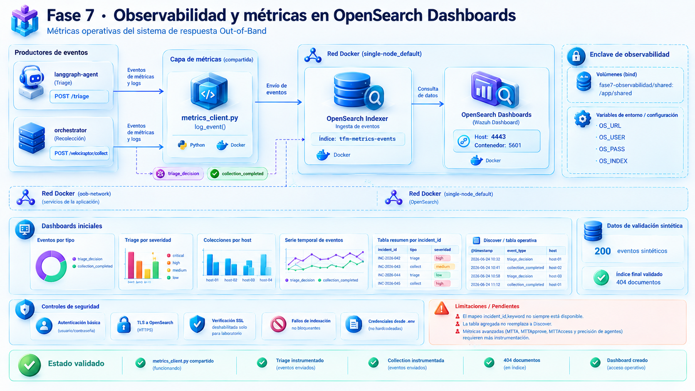

# 📊 Fase 7 · Observabilidad y métricas en OpenSearch Dashboards

> [!NOTE]
> **🎯 Objetivo de la fase**  
> Desplegar un pipeline mínimo de métricas operativas para el sistema de respuesta out-of-band, indexando eventos relevantes en OpenSearch y visualizándolos en un dashboard inicial dentro de OpenSearch Dashboards.

> [!TIP]
> Esta fase queda alineada con las anteriores: mantiene despliegue en Docker, separación por servicios (`langgraph-agent`, `orchestrator`, `Wazuh/OpenSearch`) y validación incremental mediante pruebas controladas.

## 📋 Estado

- [x] 🧩 Cliente de métricas compartido (`metrics_client.py`)
- [x] 🤖 Instrumentación en `langgraph-agent` (endpoint `/triage`)
- [x] 🧭 Instrumentación en `orchestrator` (endpoint `/velociraptor/collect`)
- [x] 🧪 Carga de datos sintéticos (200 eventos)
- [x] 📈 Dashboard inicial en OpenSearch Dashboards
- [x] 📦 Dashboard exportado y versionado (`dashboards/tfm-fase7-observabilidad.ndjson`, 2026-09-24)
- [ ] 📊 Métricas avanzadas (MTTA, MTTApprove, Agent Precision)

> [!WARNING]
> **Reproducibilidad (2026-09-24).** Desde el repositorio se puede reconstruir
> **la visualización**: el dashboard y sus objetos dependientes están exportados
> en `dashboards/` (8 objetos, `missingRefCount: 0`). **No se pueden reconstruir
> los datos**: el script de carga y el CSV sintético no están versionados, y el
> índice mezcla eventos reales y sintéticos sin forma de distinguirlos. Medido el
> 2026-09-24: `tfm-metrics-events` con 2.147 documentos.



## 🏗️ Arquitectura de observabilidad

```text
🤖 langgraph-agent ──log_event()──► 🔎 OpenSearch Indexer ──► 📊 OpenSearch Dashboards
       │
       └── event_type=triage_decision

🧭 orchestrator ─────log_event()──► 🔎 OpenSearch Indexer ──► 📊 OpenSearch Dashboards
       │
       └── event_type=collection_completed
```

> [!IMPORTANT]
> En este despliegue, OpenSearch Dashboards reutiliza el dashboard de Wazuh ya presente en el stack Docker y publicado en el host por el puerto `4443 -> 5601`.
>
> **Corrección (2026-09-24):** el puerto `4443` se retiró en el P1-1a Fase C. El acceso vigente es por Traefik en `https://wazuh.oob.local` (ver «Acceso al dashboard»).

## 🔧 Cambios aplicados

### 1. 🧩 Cliente de métricas compartido

Se creó un fichero compartido `metrics_client.py` montado por bind en ambos servicios. Su implementación se rehizo con `urllib` en lugar de `requests` para evitar dependencias no presentes en las imágenes base.

**Características principales:**
- ✅ Sin dependencias externas.
- 🔐 Autenticación básica contra OpenSearch.
- 🔒 SSL sin validación estricta para el laboratorio.
- ⚠️ Fallo no bloqueante: si la indexación falla, no rompe el flujo principal.

### 2. 🤖 Instrumentación en servicios

#### `langgraph-agent`

Se añadió el import del cliente compartido y una llamada a `log_event()` al final del endpoint `POST /triage`, registrando:
- `event_type=triage_decision`
- `incident_id`
- `host`
- `profile`
- `decision`
- `source=langgraph-agent`

#### `orchestrator`

Se añadió el import del cliente compartido y una llamada a `log_event()` al final del endpoint `POST /velociraptor/collect`, registrando:
- `event_type=collection_completed`
- `incident_id`
- `host`
- `profile`
- `collection_id`
- `minio_path`
- `duration_ms`
- `source=orchestrator`

### 3. 🌐 Redes, variables y volumen compartido

Ambos `docker-compose.yml` se actualizaron para:
- ➕ añadir la red externa `single-node_default`,
- 📦 exponer variables `OS_URL`, `OS_USER`, `OS_PASS`, `OS_INDEX`,
- 📁 montar el volumen `../fase7-observabilidad/shared:/app/shared`.

## ⚙️ Configuración aplicada

> [!NOTE]
> **Extractos desfasados (nota 2026-09-24).** Los fragmentos de compose de esta
> sección son una foto del momento en que se instrumentaron los servicios; el
> estado vigente está en el `docker-compose.yml` de cada fase y no se duplica
> aquí. Diferencias medidas: `langgraph-agent` no publica el puerto 8000 en el
> host (solo `expose`), y el orchestrator publica en `127.0.0.1:8020`, no en
> todas las interfaces. Además, `/velociraptor/collect` exige firma HMAC desde el
> P0-4 (orchestrator); eso consta por el código, no por prueba de comportamiento
> (D-12 de la auditoría de cierre).

### 🤖 `langgraph-agent`

> Extracto ilustrativo. El fichero autoritativo es
> `fase3-agentic/docker-compose.yml`. `OS_USER` y `OS_PASS` se cargan desde
> `.env` (`env_file`), nunca en el compose: `OS_PASS` debe coincidir con
> `INDEXER_PASSWORD` de `fase1-infraestructura/wazuh/single-node/.env`, que se
> rotó (ver `fase5-velociraptor/SECURITY-NOTICE.md`, P0-3).

```yaml
services:
  langgraph-agent:
    build: .
    container_name: langgraph-agent
    restart: unless-stopped
    ports:
      - "8000:8000"
    env_file:
      - .env                       # OS_USER, OS_PASS
    environment:
      - OLLAMA_BASE_URL=http://ollama:11434
      - OLLAMA_MODEL=mistral:7b
      - TZ=Europe/Madrid
      - OS_URL=https://single-node-wazuh.indexer-1:9200
      - OS_INDEX=tfm-metrics-events
    volumes:
      - ../fase7-observabilidad/shared:/app/shared
    networks:
      - oob-network
      - single-node_default

networks:
  oob-network:
    external: true
  single-node_default:
    external: true
```

### 🧭 `orchestrator`

> Extracto ilustrativo. El fichero autoritativo es
> `fase5-orchestrator-api/docker-compose.yml`. Las credenciales de MinIO
> (`MINIO_ACCESS_KEY` / `MINIO_SECRET_KEY`, del usuario `tfm-orchestrator`) y
> `OS_PASS` se cargan desde `.env` (`env_file`), nunca en el compose (P0-3, ver
> `fase5-velociraptor/SECURITY-NOTICE.md`).

```yaml
services:
  orchestrator:
    build: .
    container_name: orchestrator
    restart: unless-stopped
    ports:
      - "8020:8000"
    networks:
      - oob-network
      - single-node_default
    env_file:
      - .env                       # MINIO_ACCESS_KEY, MINIO_SECRET_KEY, OS_PASS
    environment:
      MINIO_ENDPOINT: minio:9000
      MINIO_BUCKET: evidence
      MINIO_SECURE: "false"
      OS_URL: https://single-node-wazuh.indexer-1:9200
      OS_USER: admin
      OS_INDEX: tfm-metrics-events
    volumes:
      - ../fase7-observabilidad/shared:/app/shared:ro

networks:
  oob-network:
    external: true
  single-node_default:
    external: true
```

## 🧪 Dataset sintético de pruebas

Para enriquecer las visualizaciones se generó un conjunto sintético de 200 eventos con secuencias temporales y combinaciones de:
- `triage_decision`
- `collection_completed`
- múltiples hosts,
- varias severidades,
- varios perfiles de colección.

> [!TIP]
> El índice terminó alcanzando 404 documentos en la validación final, combinando las pruebas manuales iniciales y la carga sintética posterior.

### 📥 Script de carga

Se utilizó un script Python para importar el CSV sintético a OpenSearch vía HTTPS autenticado.

> **Nota (2026-09-24):** ni el script ni el CSV están versionados en este
> repositorio; solo consta una copia en una caché local, y el script contiene una
> contraseña por defecto que habría que retirar antes de rescatarlo
> (`docs/INVENTARIO-artefactos-huerfanos.md`). El comando siguiente documenta cómo
> se usó; no es reproducible desde el repositorio.

```bash
python3 import_fase7_metrics.py --csv fase7_metrica_datos_test_200.csv --url https://localhost:9200
```

## ✅ Validación funcional

### 🧪 Pruebas unitarias de emisión

#### 🤖 Triage

```bash
docker exec -it langgraph-agent python3 -c "
from app.main import triage
from app.models import TriageRequest
print(triage(TriageRequest(wazuh={'incident_id':'TEST-TRIAGE-01','host':'HOST-01'}, cti={})))
"
```

#### 🧭 Collection

```bash
docker exec -it orchestrator python3 -c "
from main import collect, CollectRequest
import asyncio
print(asyncio.run(collect(CollectRequest(incidentid='TEST-COLLECT-01', host='HOST-02', profile='generic_high_signal_collection'))))
"
```

> **Nota (2026-09-24):** esta prueba ya no se ejecuta tal cual. Desde el P0-4
> (orchestrator) el endpoint tiene la firma `collect(request: Request)` y verifica
> una firma HMAC antes de procesar el cuerpo (`fase5-orchestrator-api/main.py`),
> de modo que la llamada directa con `CollectRequest` falla.

### 🔎 Verificación en OpenSearch

`$OS_PASS` es la contraseña del indexador (`INDEXER_PASSWORD` en
`fase1-infraestructura/wazuh/single-node/.env`, rotada — ver
`fase5-velociraptor/SECURITY-NOTICE.md`, P0-3). Cárgala del `.env` de la fase,
no la escribas en el comando:

```bash
curl -sk -u "admin:${OS_PASS:?exporta OS_PASS antes de ejecutar}" \
  "https://localhost:9200/tfm-metrics-events/_count?pretty"
```

Resultado validado en laboratorio:

```json
{
  "count": 404
}
```

> Medido de nuevo el 2026-09-24: **2.147** documentos. El índice ha seguido
> creciendo desde esta validación.

## 📊 Dashboard inicial

### 📁 Data View

Se creó el Data View:

```text
tfm-metrics-events*
```

con campo temporal:

```text
@timestamp
```

### 📈 Visualizaciones creadas

| Panel | Tipo | Filtro principal | 🎯 Propósito |
|---|---|---|---|
| 📊 Eventos por tipo | Barras | Sin filtro | Distribución `triage_decision` vs `collection_completed` |
| 🤖 Triage por severidad | Barras | `source = langgraph-agent` | Distribución de decisiones del agente |
| 🧭 Colecciones por host | Barras | `event_type = collection_completed` | Frecuencia de colecciones por activo |
| 📈 Serie temporal de eventos | Línea/Área | Sin filtro | Evolución temporal del flujo |
| 📋 Tabla resumen | Tabla agregada | Agrupada por `incident_id` | Resumen sintético por incidente |
| 🔍 Tabla operativa | Discover guardado | Sin filtro | Inspección de documentos individuales |

> **Corrección (2026-09-24), según la exportación versionada:** el dashboard
> guardado contiene 5 visualizaciones (*Eventos por tipo*, *Triage por
> severidad*, *Colecciones por Host*, *Serie temporal de eventos* y *Tabla
> operativa de eventos*) y 1 búsqueda guardada (*Busqueda TFM*). La *Tabla
> resumen* agregada por `incident_id` **no figura** entre los objetos del
> dashboard, y la *Tabla operativa* es una visualización, no un Discover
> guardado. Lo vigente es la exportación.

### 🔗 Acceso al dashboard

En este entorno, OpenSearch Dashboards está disponible en:

~~`https://<HOST>:4443`, porque el contenedor `single-node-wazuh.dashboard-1` publica `5601/tcp` en el puerto host `4443`.~~

**Corrección (2026-09-24).** El puerto `4443` se retiró en el P1-1a Fase C
(medido con `ss`: no escucha) y el contenedor no publica ningún puerto en el
host. El acceso vigente es por Traefik, con Authelia delante según la
configuración del borde; es la ruta de uso diario:

```text
https://wazuh.oob.local/app/dashboards#/view
```

La exportación de `dashboards/` se obtuvo contra la API del contenedor en su IP
de `oob-network`, desde el propio host.

**Reimportación en otro despliegue (procedimiento no ejecutado):**

```bash
curl -sk -u "admin:${OS_PASS:?exporta OS_PASS antes de ejecutar}" -H 'osd-xsrf: true' \
  -X POST "https://<dashboards>:5601/api/saved_objects/_import?overwrite=true" \
  --form file=@dashboards/tfm-fase7-observabilidad.ndjson
```

El índice `tfm-metrics-events` debe existir para que las visualizaciones
muestren datos.

## ⚠️ Limitaciones observadas

- 🔍 El campo `incident_id.keyword` no estuvo disponible en todas las consultas, lo que sugiere mapping dinámico mejorable.
- 📋 La tabla agregada del dashboard muestra resúmenes útiles, pero no sustituye una vista documental completa en Discover.
- 📊 Métricas avanzadas como MTTA, MTTApprove, MTTAccess o precisión del agente requerirán instrumentar más eventos en fases posteriores.
- 🔁 Datos no reproducibles desde el repositorio y mezcla indistinguible de eventos reales y sintéticos (ver «Estado»).
- 🔑 Las métricas se escriben con la cuenta `admin` del indexador; el rol dedicado `tfm_metrics_writer` solo está planificado (`fase3-agentic/docs/rotacion-credenciales-metricas.md`).

## 🚀 Próximos pasos

1. 🔧 Definir un mapping o template explícito para `tfm-metrics-events`.
2. 📝 Instrumentar más hitos del flujo (`war_room_created`, `approval_requested`, `approval_granted`, `remote_access_started`, etc.).
3. 📈 Refinar el dashboard con KPIs derivados.
4. 📸 ~~Exportar capturas o artefactos del dashboard para anexos del TFM.~~ Exportación hecha el 2026-09-24 (`dashboards/`); quedan las capturas para los anexos.
5. 📚 Evolucionar la documentación a una versión visual enriquecida si se quiere uniformidad completa con el resto de fases.
